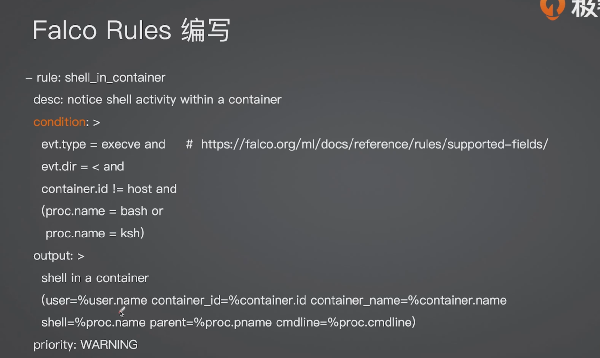

 


 


抓取某一个进程  在内核层面 处理http请求 消耗的事件 

```plain
from bcc import  BPF
import  time
##解析命令行参数
import  argparse
#构造 一个命令行参数解析器 用于接收用户输入的希望监控的目标进程PID
parser=argparse.ArgumentParser(
   description="PID"
)

##添加-p 或者--Pid
parser.add_argument(
    "-p","--pid", type=int,required=True,help="yhe pid of go process"
)

#从命令行解析用户输入的参数
arg=parser.parse_args()
target_pid=args.pid

#定义ebpf程序
bpf_text="""
#include <upai/linux/ptarce.h>  #ebpf程序需要的用户态的头文件
#include <linux/sched.h> //提供调度程序相关的结构体的定义
//定义一个结构体用来存储跟踪数据，把数据从内核态发送到用户态
struct data_t {
  u32 pid; //进程id
  u64 latency; //延迟时间
  char commm[TASK_COMM_LEN]; //进程名
};
// 定义一个哈希表用来存储每个pid的开始时间戳
BPF_HASH(start,u32);
//定义一个缓冲区，用来把时间传递到用户态
BPF_PERF_OUTPUT(events);

//定义ebpf函数，触发点tcp——sendmsg 表示发送tcp消息的时候
int  tarce_start(struct pt_regs *ctx,struct sock *sk){
  //获取当前进程的pid
  u32 pid= bpf_get_current_pid_tgid() >>32;

  //只跟踪目标的pid
  if （pid！= TARGET_PID）{
    return 0;
  }
  // 获取内核的时间戳 （单位是 ns）
  u64 ts =bpf_ktime_get_ns();
  //事件戳存放到哈希表，键pid，值是时间戳
   start.update(&pdi,&ts);

   return 0;
}
//另一个结束触发点,tcp_cleanup_rbuf
int trace_end(struct pt_regs *ctx,struct sock *sk){
  //获取当前进程的pid
  u32 pid =bpf_get_current_pid_tgid() >>32;
  // 只追踪目标pid
  if （pid ！=TARGENT_PID）{
     return 0；
  }
   // 从哈希表查找之前记录的开始时间戳
   u64 *tsp =start.lookup(&pid);

   //没有找到开始的时间戳，可能是错过了start事件，直接返回
   if （tsp==0）{
     return 0；
   }
   // 计算延迟，当前时间戳减去开始的时间戳
   u64 delta=bpf_ktime_get_ns() -*tsp;
   //删除哈希表的记录，因为数据已经用了
   start.delete(&pid);

   //初始化一个结构，用来存储并发送事件
   struct data_t data ={}
   data.pid =pid;
   data.latency= delta;
   bpf_get_current_commm(&data.comm,sizeof(data.comm));

   //把收集到的数据发送到用户态
   events.perf_submit(ctx,&data,sizeof(data))

   
}
"""

##替换ebpf程序中的占位符 TARGET_PID 
bpf_text=bpf_text.replace("TARGET-PID",str(target_pid))

#加载
b=BPF(text=bpf_text)

#trace_start 添加到tcp_sendmsg 内核函数
b.attch_kprobe(event="tcp_sendmsg",fn_name="trace_start")
b.attch_kprobe(event="tcp_cleanup_rbuf",fn_name="trace_end")


##定义回调函数，处理ebpf程序发送到用户态的事件
def print_ebent(cpu,data,size):
   event = b["events"].event(data)
   print(
      f"[{time.strftime('%H:%M:%S')}] PID:{event.pid}, COMM:{event.comm.decode('utf-8','replace')},Latency:{event.latency/ 1e6:.2f}" 
   )

b["events"].open_perf_buffer(print_event)

#输出提示信息
print（f"Tracing HTTP Request For PID {target_pid}"）

##写一个无限循环
while True：
   try：
      b.perf_buffer_poll()
   except KeyboardInterrupt:
       exit()
```


#  Beyla 


ebpf 会记录到 自己服务在内部队列等待的时间   这样更精准 


最后得到的反馈是 无代码层面的侵入可以得到ebpf的反馈的指标 


cilium 


 


最后的效果


生成拓扑


# ebpf+elaco 实时监控k8s安全威胁





