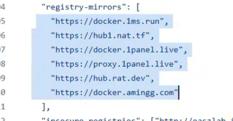

```toml
[plugins."io.containerd.grpc.v1.cri".registry]
  # ---------------------------
  # 认证配置（保留空表示未配置）
  # ---------------------------
  [plugins."io.containerd.grpc.v1.cri".registry.auths]

  # ---------------------------
  # 仓库 TLS/HTTPS 高级配置
  # ---------------------------
  [plugins."io.containerd.grpc.v1.cri".registry.configs]
    # 针对私有仓库 easzlab.io.local:5000 跳过 TLS 证书验证
    # 适用场景：使用自签名证书或 HTTP 明文传输
    [plugins."io.containerd.grpc.v1.cri".registry.configs."easzlab.io.local:5000".tls]
      insecure_skip_verify = true  # 生产环境慎用

    # 针对私有仓库 harbor.easzlab.io.local:8443 跳过 TLS 证书验证
    [plugins."io.containerd.grpc.v1.cri".registry.configs."harbor.easzlab.io.local:8443".tls]
      insecure_skip_verify = true

  # ---------------------------
  # 自定义 HTTP 请求头（保留空）
  # ---------------------------
  [plugins."io.containerd.grpc.v1.cri".registry.headers]

  # ---------------------------
  # 镜像仓库镜像加速/替换规则
  # ---------------------------
  [plugins."io.containerd.grpc.v1.cri".registry.mirrors]
    # 本地私有仓库配置
    [plugins."io.containerd.grpc.v1.cri".registry.mirrors."easzlab.io.local:5000"]
      endpoint = ["http://easzlab.io.local:5000"]  # 使用 HTTP 协议（非加密）

    [plugins."io.containerd.grpc.v1.cri".registry.mirrors."harbor.easzlab.io.local:8443"]
      endpoint = ["https://harbor.easzlab.io.local:8443"]  # 使用 HTTPS 协议

    # ---------------------------
    # 公共仓库加速源配置
    # ---------------------------
    # Docker 官方镜像加速（多备用源）
    [plugins."io.containerd.grpc.v1.cri".registry.mirrors."docker.io"]
      endpoint =  [
    "https://docker.1panel.live",
    "https://hub.mirrorify.net",
    "https://docker.m.daocloud.io",
    "https://registry.dockermirror.com",
    "https://docker.aityp.com/",
    "https://docker.anyhub.us.kg",
    "https://dockerhub.icu",
    "https://docker.awsl9527.cn"
  ]

    # Google Container Registry 加速
    [plugins."io.containerd.grpc.v1.cri".registry.mirrors."gcr.io"]
     endpoint =  [
    "https://docker.1panel.live",
    "https://hub.mirrorify.net",
    "https://docker.m.daocloud.io",
    "https://registry.dockermirror.com",
    "https://docker.aityp.com/",
    "https://docker.anyhub.us.kg",
    "https://dockerhub.icu",
    "https://docker.awsl9527.cn"
  ]

    # Kubernetes 官方镜像专用加速
    [plugins."io.containerd.grpc.v1.cri".registry.mirrors."k8s.gcr.io"]
     endpoint =  [
    "https://docker.1panel.live",
    "https://hub.mirrorify.net",
    "https://docker.m.daocloud.io",
    "https://registry.dockermirror.com",
    "https://docker.aityp.com/",
    "https://docker.anyhub.us.kg",
    "https://dockerhub.icu",
    "https://docker.awsl9527.cn"
  ]

    # Quay.io 镜像加速
    [plugins."io.containerd.grpc.v1.cri".registry.mirrors."quay.io"]
     endpoint =  [
    "https://docker.1panel.live",
    "https://hub.mirrorify.net",
    "https://docker.m.daocloud.io",
    "https://registry.dockermirror.com",
    "https://docker.aityp.com/",
    "https://docker.anyhub.us.kg",
    "https://dockerhub.icu",
    "https://docker.awsl9527.cn"
  ]

    # GitHub Container Registry 加速
    [plugins."io.containerd.grpc.v1.cri".registry.mirrors."ghcr.io"]
    endpoint =  [
    "https://docker.1panel.live",
    "https://hub.mirrorify.net",
    "https://docker.m.daocloud.io",
    "https://registry.dockermirror.com",
    "https://docker.aityp.com/",
    "https://docker.anyhub.us.kg",
    "https://dockerhub.icu",
    "https://docker.awsl9527.cn"
  ]

    # NVIDIA NGC 镜像加速
    [plugins."io.containerd.grpc.v1.cri".registry.mirrors."nvcr.io"]
   endpoint =  [
    "https://docker.1panel.live",
    "https://hub.mirrorify.net",
    "https://docker.m.daocloud.io",
    "https://registry.dockermirror.com",
    "https://docker.aityp.com/",
    "https://docker.anyhub.us.kg",
    "https://dockerhub.icu",
    "https://docker.awsl9527.cn"
  ]
```


别人给的参考的

```toml
# 创建默认配置文件
mkdir -p /etc/containerd
# 创建containerd默认配置文件
containerd config default | tee /etc/containerd/config.toml

# 关键配置修改
sed -i \
  -e 's/SystemdCgroup = false/SystemdCgroup = true/' \
  -e 's|registry.k8s.io/pause:3.8|registry.cn-hangzhou.aliyuncs.com/google_containers/pause:3.9|' \
  -e 's|config_path = ""|config_path = "/etc/containerd/certs.d"|' \
  /etc/containerd/config.toml

mkdir /etc/containerd/certs.d/docker.io -pv

# 配置加速器
# docker hub镜像加速
mkdir -p /etc/containerd/certs.d/docker.io
cat > /etc/containerd/certs.d/docker.io/hosts.toml << EOF
server = "https://docker.io"
[host."https://dockerproxy.com"]
  capabilities = ["pull", "resolve"]

[host."https://docker.m.daocloud.io"]
  capabilities = ["pull", "resolve"]

[host."https://reg-mirror.qiniu.com"]
  capabilities = ["pull", "resolve"]

[host."https://registry.docker-cn.com"]
  capabilities = ["pull", "resolve"]

[host."http://hub-mirror.c.163.com"]
  capabilities = ["pull", "resolve"]

EOF

# registry.k8s.io镜像加速
mkdir -p /etc/containerd/certs.d/registry.k8s.io
tee /etc/containerd/certs.d/registry.k8s.io/hosts.toml << 'EOF'
server = "https://registry.k8s.io"

[host."https://k8s.m.daocloud.io"]
  capabilities = ["pull", "resolve", "push"]
EOF

# docker.elastic.co镜像加速
mkdir -p /etc/containerd/certs.d/docker.elastic.co
tee /etc/containerd/certs.d/docker.elastic.co/hosts.toml << 'EOF'
server = "https://docker.elastic.co"

[host."https://elastic.m.daocloud.io"]
  capabilities = ["pull", "resolve", "push"]
EOF

# gcr.io镜像加速
mkdir -p /etc/containerd/certs.d/gcr.io
tee /etc/containerd/certs.d/gcr.io/hosts.toml << 'EOF'
server = "https://gcr.io"

[host."https://gcr.m.daocloud.io"]
  capabilities = ["pull", "resolve", "push"]
EOF

# ghcr.io镜像加速
mkdir -p /etc/containerd/certs.d/ghcr.io
tee /etc/containerd/certs.d/ghcr.io/hosts.toml << 'EOF'
server = "https://ghcr.io"

[host."https://ghcr.m.daocloud.io"]
  capabilities = ["pull", "resolve", "push"]
EOF

# k8s.gcr.io镜像加速
mkdir -p /etc/containerd/certs.d/k8s.gcr.io
tee /etc/containerd/certs.d/k8s.gcr.io/hosts.t
```


自己操作的

```plain
[plugins."io.containerd.grpc.v1.cri".registry.mirrors]
         [plugins."io.containerd.grpc.v1.cri".registry.mirrors."easzlab.io.local:5000"]
           endpoint = ["http://easzlab.io.local:5000"]
         [plugins."io.containerd.grpc.v1.cri".registry.mirrors."harbor.easzlab.io.local:8443"]
           endpoint = ["https://harbor.easzlab.io.local:8443"]
         [plugins."io.containerd.grpc.v1.cri".registry.mirrors."docker.io"]
           endpoint = ["https://hub.mirrorify.net"]
         [plugins."io.containerd.grpc.v1.cri".registry.mirrors."gcr.io"]
           endpoint = ["https://hub.mirrorify.net"]
         [plugins."io.containerd.grpc.v1.cri".registry.mirrors."k8s.gcr.io"]
           endpoint = ["https://hub.mirrorify.net"]
         [plugins."io.containerd.grpc.v1.cri".registry.mirrors."quay.io"]
           endpoint = ["https://hub.mirrorify.net"]
         [plugins."io.containerd.grpc.v1.cri".registry.mirrors."ghcr.io"]
           endpoint = ["https://hub.mirrorify.net"]
         [plugins."io.containerd.grpc.v1.cri".registry.mirrors."nvcr.io"]
           endpoint = ["https://hub.mirrorify.net"]
```

：%s#docker.1panel.live#hub.mirrorify.net#g


https://hub.mirrorify.net


先替换一个镜像   然后 	

crictl pull nginx:latest


拉一个镜像能拉下去就完事了


