# [Apollo配置更新](https://docs.aijidou.com/pages/viewpage.action?pageId=8749131)

点击编辑按钮

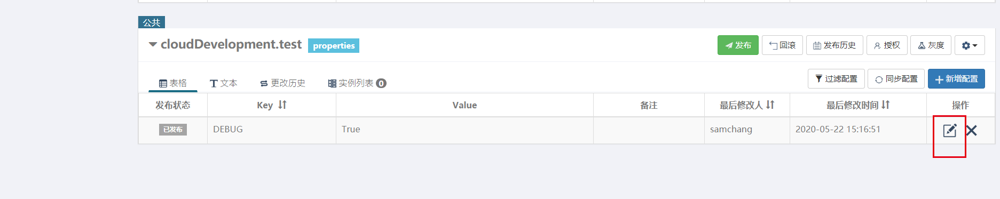

2 输入更新后的值并点击提交

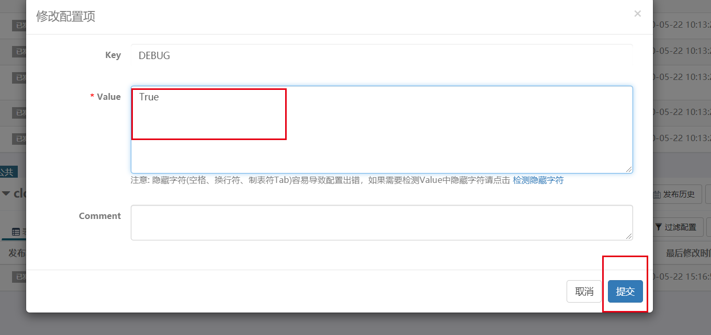

3 点击发布按钮

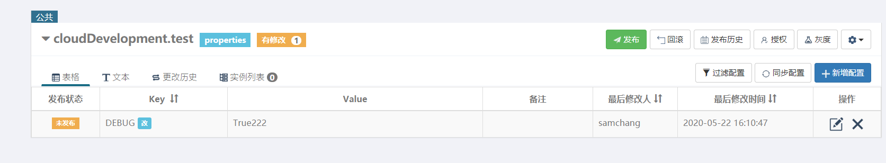

4 填写发布信息发布

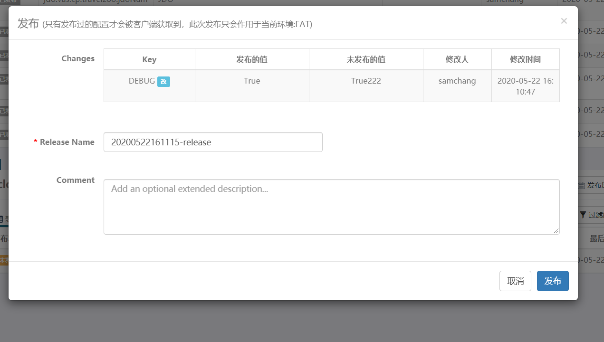

 

# [修改配置后未生效](https://docs.aijidou.com/pages/viewpage.action?pageId=8749122)

重启pod

# [新增服务，如何配置Apollo?](https://docs.aijidou.com/pages/viewpage.action?pageId=8749091)

### 新增服务，如何配置Apollo?

A:1 准备信息，你需要开发提供配置名，和具体配置内容

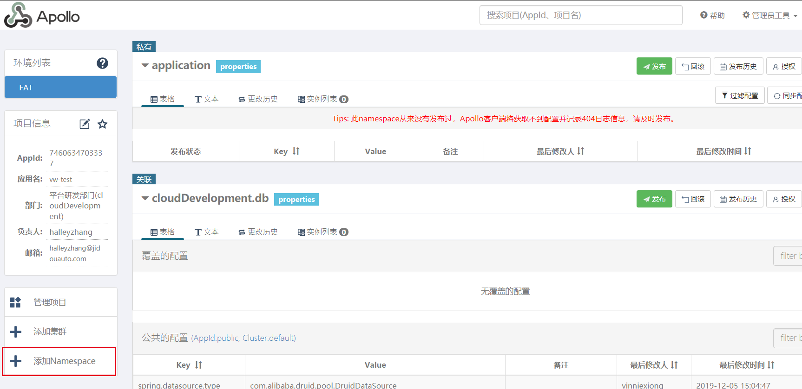

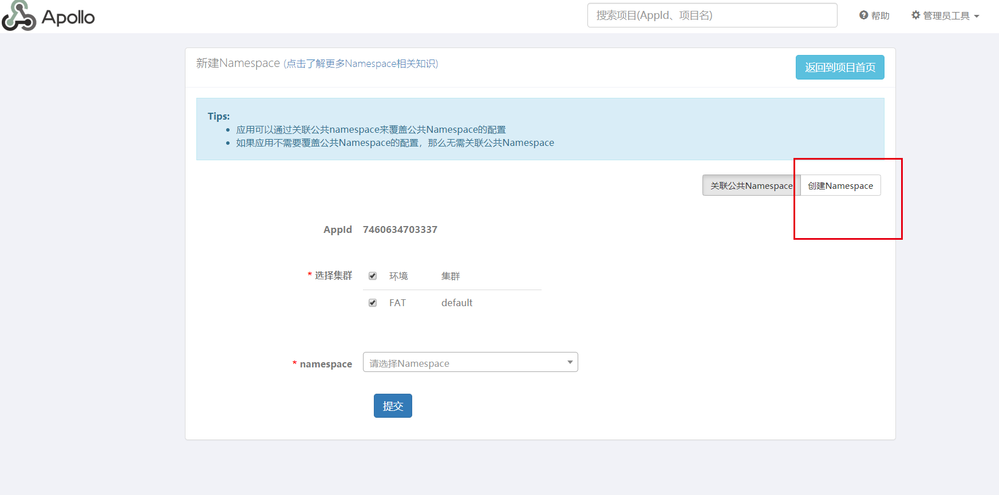

2 填入配置项名称，点击提交

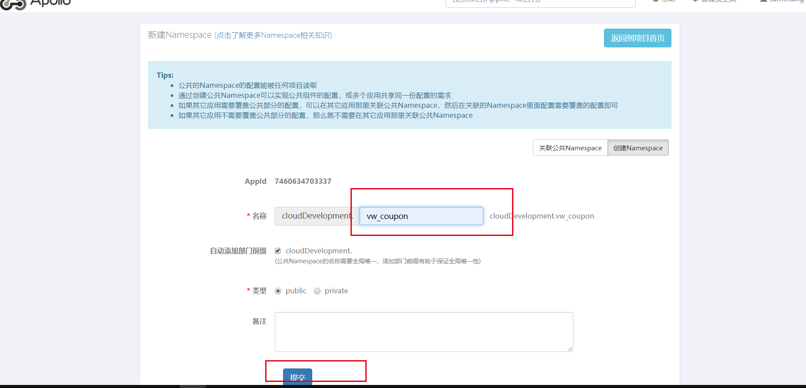

3 添加授权人

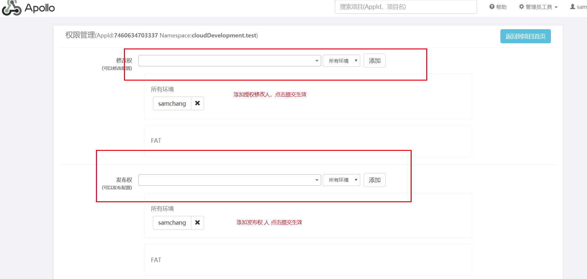

4 返回项目首页

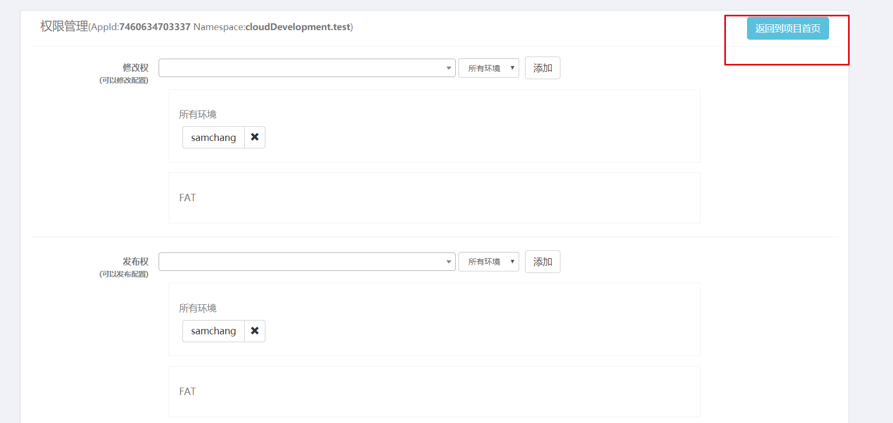

5 找到新增配置

按键盘end键或ctrl + f 搜索配置名

# [Q: 给服务信息添加具体配置](https://docs.aijidou.com/pages/viewpage.action?pageId=8749105)

A : 1 按end键或ctrl + f 搜索test找到配置项

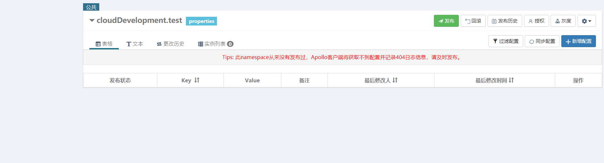

2 点击文本

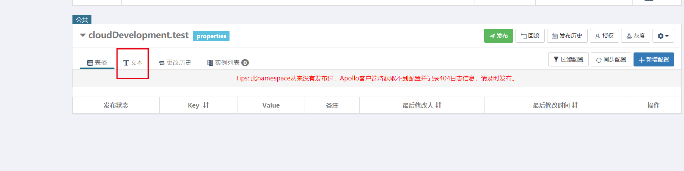

3 点击按钮就行编辑

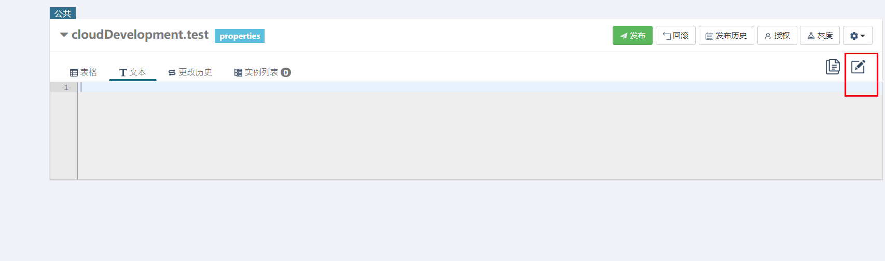

4 填入配置信息，点击右上角对号保存

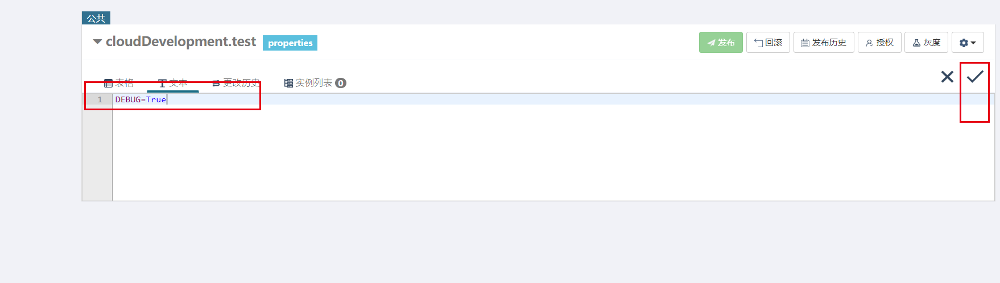

5 点击发布，发布配置

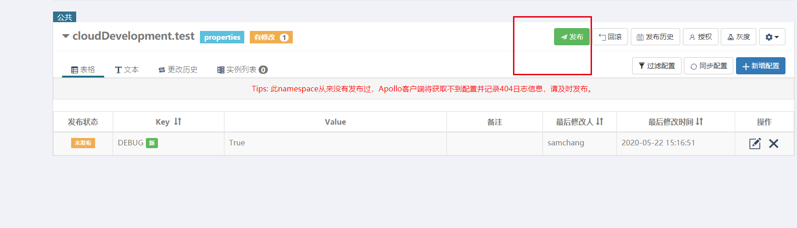

6 填写发布信息

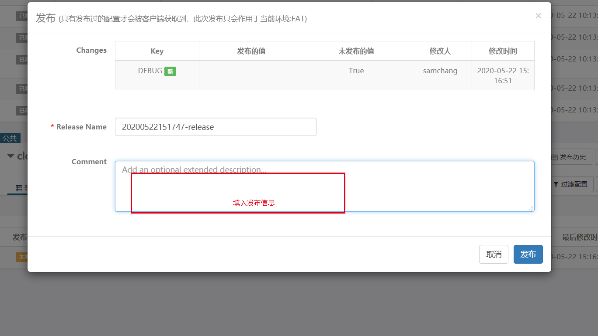

7 点击发布

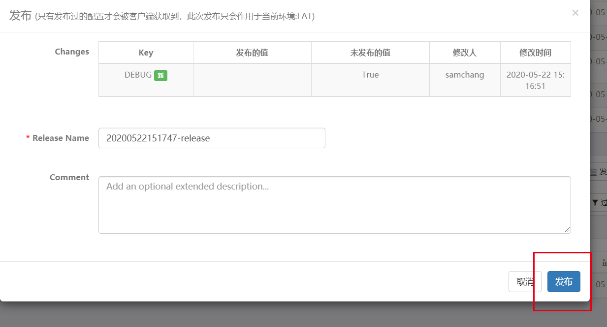

8 发布成功

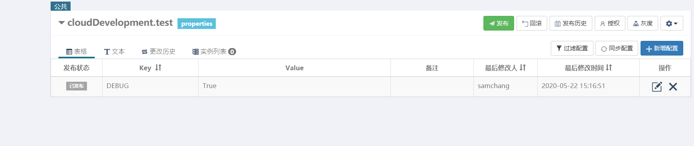