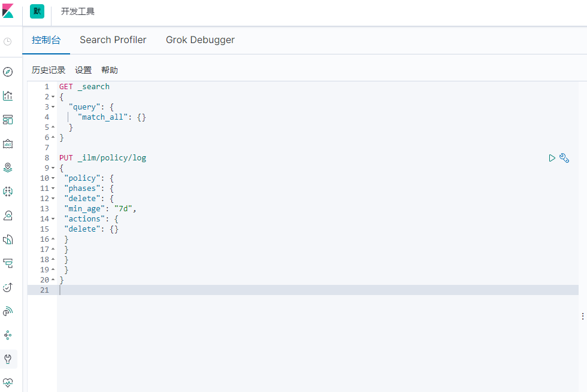
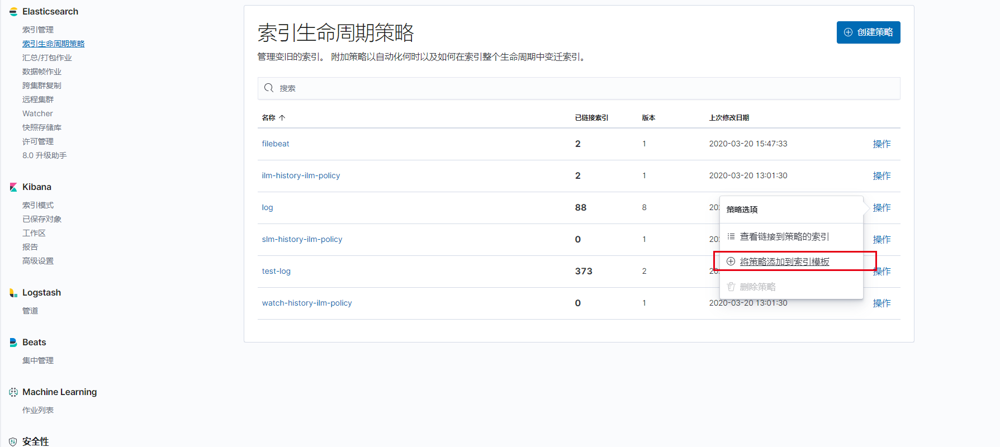
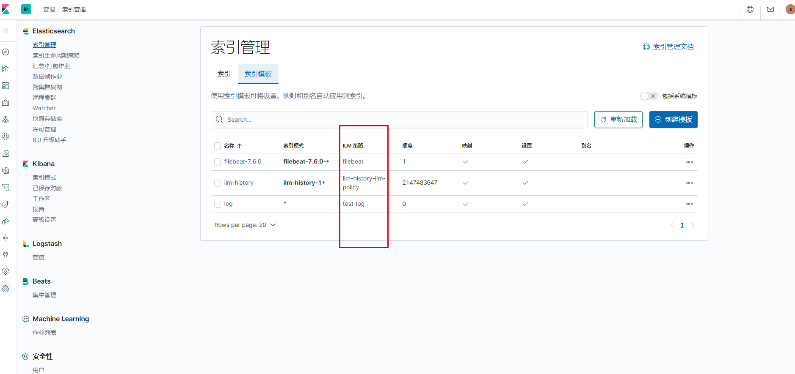

# elasticsearch 配置日志定期删除

参考文档：

1 官方索引生命周期介绍https://www.elastic.co/guide/en/elasticsearch/reference/7.6/overview-index-lifecycle-management.html

2 谷歌论坛的方案介绍（主要参考）https://groups.google.com/forum/#!topic/wazuh/wujabCAq15A

### 1 介绍

目前仅在dev 和tui环境的kibana 上面配置了定期删除索引的周期策略。

### 2 配置步骤

1 登录kibana

2 选择一个命名空间

3 点击devtools

4 输入put请求，创建一个七天后删除的策略

--------------------代码-----------------------

PUT _ilm/policy/log
{
"policy": {
"phases": {
"delete": {
"min_age": "7d",
"actions": {
"delete": {}
}
}
}
}
}

------------------------代码--------------------------

5 点击设置，点击索引生命周期策略关联索引到索引模板

6 查看索引模板关联的周期策略

7 完成，由指定模板创建出来的索引会在七天后删除