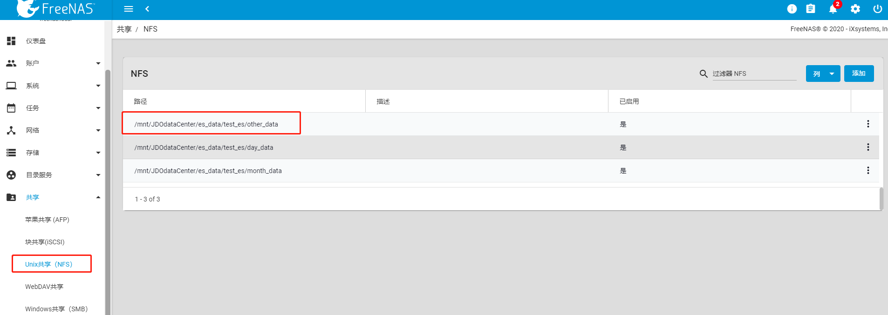

# es优化策略

## es索引定时优化，索引合并，定时清理废弃数据

## es索引数据冷热分离

## es索引数据快照备份

## es索引数据生命周期优化

## es节点利用ldap做认证


**修改ES分片上限**

*PUT /_cluster/settings*
{
"transient": {
"cluster": {
"max_shards_per_node":10000
}
}
}

**设置 elasticsearch 磁盘上限，避免磁盘空间达到80%出现数据大批量转移 或 多节点磁盘空不足导致故障**


*PUT /_cluster/settings*
*{*
*"transient": {*
*"cluster.routing.allocation.disk.watermark.low": "90%",*
*"cluster.routing.allocation.disk.watermark.high": "95%",*
*"*[*cluster.info*](http://cluster.info/)*.update.interval": "1m"*
*}*
*}*

**可以设置下面的属性，使DELETE /_all 失效，必须指定索引名称，才可以删除。***
**elasticsearch.yml**
**action.destructive_requires_name: true*

*PUT /_cluster/settings*
*{*
*"**persistent**": {*
*"**action.destructive_requires_name**": true*
*}*
*}*


**删除es快照**

*Delete /_snapshot/month_back/es-month-all-2020.10.02-od0vqtzgs5oqbwbgxdts1w*

*{
**}*

**ElasticSearch 7.x 解决 TooManyBucketsException 问题**

**解决方法：**

ElasticSearch 7.x 版本出现如下提示: Caused by: org.elasticsearch.search.aggregations.MultiBucketConsumerService$TooManyBucketsException: Trying to create too many buckets. Must be less than or equal to: [10000] but was [10314]. This limit can be set by changing the [search.max_buckets] cluster level setting.

分析: 这是6.x以后版本的特性, 目的是限制大批量聚合操作, 规避性能风险.

**解决方法1****: 增加ElasticSearch的search.max_buckets限制**


curl -X PUT "localhost:9200/_cluster/settings" -H 'Content-Type: application/json' -d '{"persistent": { "search.max_buckets": 500000 }}'

https://www.zhukun.net/archives/8468


**

**

**ElasticSearch 7.x 解决**  **circuit_breaking_exception","reason":"[parent] Data too large, data for [<http_request>] 的****问题**

**原因：**

原因 批量导入数据过多 或者 查询数据太多，比较频繁 ，**需定期执行清理缓存**

**解决方法1：**

```plain
curl --user admin:pwd  -XPOST 'http://localhost:9200/_cache/clear'
```


**解决方法2****:** 

优化查询，考虑增加服务器内存和ES集群增加  


# [es快照备份和恢复](https://docs.aijidou.com/pages/viewpage.action?pageId=11372240)

### 一.首先搭建存储nfs，两种方法，目前使用第一种

#### **1.可参考使用**[**FreeNAS**](http://172.16.15.24/)**的unix的共享存储。**

(1)添加新增数据集，调整数据集存储空间以及读写权限


(2)新增unix共享（NFS）目录路径，与数据集路径一一对应。



(3)登入FreeNAS服务器或者命令行，将新建数据集的文件夹路径权限调整为 chmod -R 777 /mnt/JDOdataCenter/*，防止挂载到目标机服务器路径导致权限锁死。


(4)登入目标机服务器（es服务器集群，每台服务器均需执行，不然数据无法同步）

yum -y install nfs-utils rpcbind
showmount -e 172.16.15.24
mount -t nfs 172.16.15.[24:/mnt/JDOdataCenter/es_data/test_es/other_data](http://0.0.0.24/mnt/JDOdataCenter/es_data/test_es/d_data) /es_backup/other_data

1、修改foo用户的uid

\# usermod -u 998 elasticsearch

2、修改foo组的gid

\# groupmod -g 996 elasticsearch

3、foo用户的家目录下面的文件属主和属组会在1、2命令执行后自动修改成新的uid、gid对应的属主属组，但是其他文件目录需要手动修改。手动修改的命令也比较简单。

\# find / -user 997 -exec chown -h elasticsearch {} \;       # find / -group 995 -exec chgrp -h elasticsearch {} \;


这样用户和组的uid、gid就修改好了。可以用id命令看下是否修改的如我们所愿。

\# ls -l /home/elasticsearch/   # id -u elasticsearch # id -g  elasticsearch # grep elasticsearch /etc/passwd # grep elasticsearch /etc/group


*mount -t nfs 101.230.249.66:/mnt/JDOdataCenter/es_data/asterix_approval_es/other_data /es_backup/other_data*

*mount -t nfs 101.230.249.66:/mnt/JDOdataCenter/es_data/asterix_approval_es/month_data /es_backup/month_data*

*mount -t nfs 101.230.249.66:/mnt/JDOdataCenter/es_data/asterix_approval_es/day_data /es_backup/day_data*

*

*

*mount -t nfs 101.230.249.66:/mnt/JDOdataCenter/es_data/**jdocloud_live_es**/other_data  /es_backup/other_data*

*mount -t nfs 101.230.249.66:/mnt/JDOdataCenter/es_data/**jdocloud_live_es**/month_data   /es_backup/month_data*

*mount -t nfs 101.230.249.66:/mnt/JDOdataCenter/es_data/**jdocloud_live_es**/day_data   /es_backup/day_data*

*

*


*mount -t nfs 101.230.249.66:/mnt/JDOdataCenter/es_data/**new_asterix_live_es**/other_data   /es_backup/other_data*


*mount -t nfs 101.230.249.66:/mnt/JDOdataCenter/es_data/**new_asterix_live_es**/month_data   /es_backup/month_data*


*mount -t nfs 101.230.249.66:/mnt/JDOdataCenter/es_data/**new_asterix_live_es**/day_data   /es_backup/day_data*

*

*


*mount -t nfs 101.230.249.66:/mnt/JDOdataCenter/es_data/**old_asterix_live_es**/other_data   /es_backup/other_data*


*mount -t nfs 101.230.249.66:/mnt/JDOdataCenter/es_data/**old_asterix_live_es**/month_data   /es_backup/month_data*


*mount -t nfs 101.230.249.66:/mnt/JDOdataCenter/es_data/**old_asterix_live_es**/day_data   /es_backup/day_data*

*

*

#### **2.可选择自建**[**nfs-utils**](https://shenshengkun.github.io/posts/dfsfa87w.html)

**server：**

yum -y install nfs-utils rpcbind
mkdir -pv /data/es
cd /data/es/
chmod 755 /data/es/
vim /etc/exports
/data/es *(rw,sync,no_root_squash)
systemctl start rpcbind.service
systemctl status rpcbind
systemctl start nfs.service
systemctl status nfs

**client：**

yum -y install nfs-utils rpcbind
showmount -e 172.16.15.24
mount -t nfs 172.16.15.24:/data/es /es_data

### 二.快照存储策略，快照存储库的创建

#### **1.快照存储库创建。**

**(1)修改 vim /etc/elasticsearch/elasticsearch.yml，**

**添加path.repo: ["/es_backup/month_data","/es_backup/day_data","/es_backup/other_data"]，并重启es集群。**

**(2)登录kibana或者es Api****创建存储库,并验证存储库状态**

#### 

#### **  **

#### **2.快照策略创建。**

  **尽量不要备份过大的系统索引**


#### **3.快照备份（执行备份策略）**


### 三.快照恢复

#### **1.恢复快照到本集群中**

**(1)目前集群中无该名称索引存活，比如七月份索引 log-2020.07 已经被删除，想从快照中恢复七月份日志数据，可直接将 快照中的该索引按 原名称恢复，无需重命名索引**


**(2)目前集群中有该名称索引存活，**

**比如es索引数据丢失 .kibana索引被强制初始化，可以直接将索引删除，或建立别名的方式，将.kibana 索引强行替换,重启kibana即可**

**比如es应用日志索引丢失，且存在该名称索引不可删除，可尝试将原索引重命名后恢复，比如 log-2020.08  可重命名为log-2020.08-001  ，恢复后同样处于 kibana 索引规则log-2020\*  规则之内，不会影响大家查询日志。**

**

**

#### **2.恢复快照到其他es集群中**

**新建es集群（单点），es索引分片机制最好和原es集群一致，通过nfs将path.repo: ["/es_backup/other_data"] 路径进行同时挂载 mount -t nfs 172.16.15.**[**24:/mnt/JDOdataCenter/es_data/test_es/other_data**](http://0.0.0.24/mnt/JDOdataCenter/es_data/test_es/other_data) **/es_backup/other_data，新es集群即可同步收到快照，并识别，可进行快照恢复，请勿随便删除。防止数据丢失。**

**备注：**

快照包含组成索引的磁盘上数据结构的副本。这意味着快照只能还原到可以读取索引的Elasticsearch版本：

- 在6.x中创建的索引快照可以恢复到7.x。
- 在5.x中创建的索引快照可以恢复到6.x。
- 可以将在2.x中创建的索引快照恢复到5.x。
- 在1.x中创建的索引快照可以恢复到2.x。


相反，无法将在1.x中创建的索引快照还原到5.x或6.x，无法将在2.x中创建的索引快照还原到6.x或7.x，以及在5中创建的索引快照。 x 无法还原到7.x或8.x。

每个快照可以包含在各种版本的Elasticsearch中创建的索引，并且在还原快照时，必须有可能将所有索引还原到目标集群中。如果快照中的任何索引是在不兼容的版本中创建的，则将无法还原快照。


# [es索引生命周期策略](https://docs.aijidou.com/pages/viewpage.action?pageId=13074936)

定义：以时间为导向对数据进行应用策略操作。
索引管理流程：热数据->暖数据->冷数据->数据归档->数据删除
索引策略动作：优先级、重索引、分片分配、只读、合并、收缩、冻结、删除

配合定时快照功能  ，每月1号进行快照备份，保留每月备份快照，可随时还原，保证数据不会丢失。