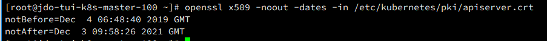
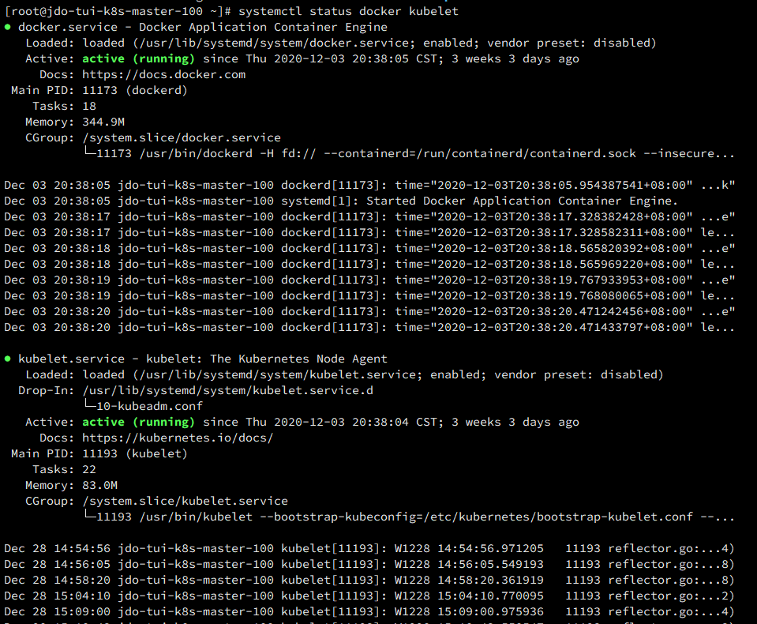

由于通过kubeadm命令起的集群默认服务证书都是只有一年的有效期，CA证书也是只有10年的有效期，如果您短期内不打算升级集群版本，那么，就需要在证书即将到期前对服务证书进行续期，防止集群出现问题；集群证书有问题时一个比较明显的症状就是，你无法发布、伸缩容器了，观察api-server的日志会发现大量的报错：

## 证书有效性检查

可以使用openssl命令对证书的有效时间进行检查，从而判断是否需要更换证书或为证书续期，目前通过Kubeadm命令部署的集群，其证书通常位于下面的路径：

**根证书：**

/etc/kubernetes/pki/ca.crt              默认10年有效期

/etc/kubernetes/pki/ca.key            配套的私钥

**服务证书：**

/etc/kubernetes/pki/apiserver.crt

/etc/kubernetes/pki/apiserver-etcd-client.crt

/etc/kubernetes/pki/apiserver-kubelet-client.crt

/etc/kubernetes/pki/front-proxy-ca.crt

/etc/kubernetes/pki/front-proxy-client.crt

**使用下面的命令可以检查证书的时间戳:**

openssl x509 -noout -dates -in /etc/kubernetes/pki/apiserver.crt

*PS: 尽量在过期前一周处置完毕，等到过期了，就比较难受了*

## 干活先备份

1. **下面的命令可以打印集群的当前初始配置信息，将输出信息重定向到一个文件，一方面用于备份，另外稍后签发证书会使用**
   \#kubeadm config view > /opt/kubeadm-cfg.yaml
2. **备份证书**
   \#cp -rp /etc/kubernetes  /opt/kubernetes.backup-20201119-1345
3. **备份ETCD数据，这里比较重要，万一没做第一步和第二步，这一步还有些回旋的余地**
   \#cp -r /var/lib/etcd  /opt/etcd.backup-20201119-1346

## 生成新的证书

1. **生成新的证书，生成证书是基于现有的kubeadm-cfg.yaml来生成的，因为证书一般与域名具有绑定关系，自建集群一般使用IP加端口访问，所以，干就完了**
   \#kubeadm alpha certs renew all --config=/opt/kubeadm-cfg.yaml
2. **重启服务**
   \#docker ps |grep -E 'k8s_kube-apiserver|k8s_kube-controller-manager|k8s_kube-scheduler|k8s_etcd_etcd' | awk -F ' ' '{print $1}' | xargs docker restart
   *PS: 使用docker ps获取当前运行中的容器，grep过滤出多个内容，awk以空格为分隔符取输出结果第一列(容器ID)，xargs可以将管道内容放到它右侧执行命令的参数内*

## 更新Master节点配置文件

1. **为了少输入些内容，我们需要设定一个变量，避免后边要输多次重复内容**
   \#export KUBE_APISERVER="https://xxx.xxx.xxx.xxx:6443"
2. **更新kubectl的连接配置，如果你观察过kubeconfig文件，你会发现将certificate-authority的内容进行Base64解码后内容和****/etc/kubernetes/pki/ca.crt完全一样**

\#kubectl config set-cluster kubernetes --certificate-authority=/etc/kubernetes/pki/ca.crt --embed-certs=true --server=${KUBE_APISERVER} --kubeconfig=/etc/kubernetes/admin.conf

\#kubectl config set-credentials kubernetes-admin --client-certificate=/etc/kubernetes/pki/apiserver-kubelet-client.crt --client-key=/etc/kubernetes/pki/apiserver-kubelet-client.key --embed-certs=true --kubeconfig=/etc/kubernetes/admin.conf

\#kubectl config set-context kubernetes-admin@kubernetes --cluster=kubernetes --user=kubernetes-admin --kubeconfig=/etc/kubernetes/admin.conf
*PS: 第一步，设定集群CA认证证书，client会拿这个证书去检查服务证书是不是合法的可信的；第二步主要是设定kubectl 与API-Server进行双向认证时需要携带的认证信息；对于新版的Kubernetes，你要想访问API-Server干点啥美好的事情，必须携带证书或Token，关于Token如何生成，咱们后面会说；这个admin.conf你可以将其拷贝到~/.kube/config；此后执行该命令时会默认使用这个配置文件*

1. **设定controller-manager的配置，在controller-manager启动的时候默认会到该位置读取这个配置文件，这个配置文件会告诉它：如何寻找到API-Server以及拿着什么样凭据去访问，任何不拿凭据的访问，都是耍流氓~**

1. 设定CA证书和集群地址，将值写入配置文件

\#kubectl config set-cluster kubernetes --certificate-authority=/etc/kubernetes/pki/ca.crt --embed-certs=true --server=${KUBE_APISERVER} --kubeconfig=/etc/kubernetes/controller-manager.conf

1. 设定双向认证使用的证书

\#kubectl config set-credentials system:kube-controller-manager --client-certificate=/etc/kubernetes/pki/apiserver-kubelet-client.crt --client-key=/etc/kubernetes/pki/apiserver-kubelet-client.key --embed-certs=true --kubeconfig=/etc/kubernetes/controller-manager.conf

1. 设定上下文关联关系，如果你使用kubectl config use-context这个命令的话，这步是一样的操作；之所以用了一种比较麻烦的配置文件纯粹是为了配置文件的一致性和可读性#kubectl config set-context system:kube-controller-manager@kubernetes --cluster=kubernetes --user=system:kube-controller-manager --kubeconfig=/etc/kubernetes/controller-manager.conf

1. **设定Scheduler的配置，在调度器服务启动时会加载该配置文件，它会知道去何处寻找API-Server以及拿什么凭据访问API-Server；步骤都是差不多的**
   \#kubectl config set-cluster kubernetes --certificate-authority=/etc/kubernetes/pki/ca.crt --embed-certs=true --server=${KUBE_APISERVER} --kubeconfig=/etc/kubernetes/scheduler.conf
   \#kubectl config set-credentials system:kube-scheduler --client-certificate=/etc/kubernetes/pki/apiserver-kubelet-client.crt --client-key=/etc/kubernetes/pki/apiserver-kubelet-client.key --embed-certs=true --kubeconfig=/etc/kubernetes/scheduler.conf
   \#kubectl config set-context system:kube-scheduler@kubernetes --cluster=kubernetes --user=system:kube-scheduler --kubeconfig=scheduler.conf
   \#kubectl config use-context system:kube-scheduler@kubernetes --kubeconfig=/etc/kubernetes/scheduler.conf
2. **设定kubelet的配置，这个比较重要，kubelet需要知道如何去寻找API-Server以及携带什么凭据，kubelet连接上API-Server后会跟具情况来拉起本节点上的容器，管理容器的生老病死**

1. 生成 kubelet.conf，如果有报错，可无需理会因为kubeadm回去一个特定的仓库回去一个字符串，如果您的集群版本旧了，就容易获取不到
   \#kubeadm alpha kubeconfig user --org system:nodes --client-name system:node:$(hostname) > /etc/kubernetes/kubelet.conf

##  测试能否启动服务

systemctl stop kubelet
systemctl stop docker

systemctl start docker
systemctl start kubelet

**没啥报错，服务如果都能起来，那就没啥毛病了，等待一下，执行这个命令:** systemctl status docker kubelet

