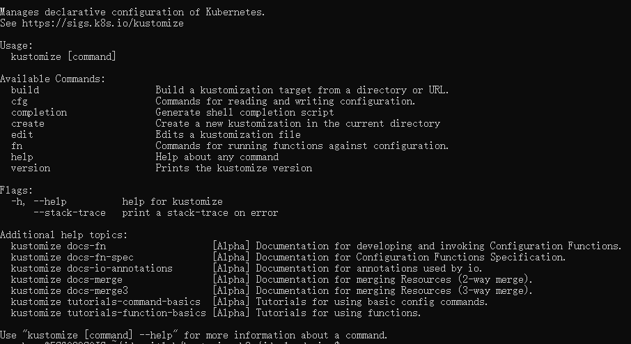

# kustomize使用文档

kustomizelets you customize raw, template-free YAML files for multiple purposes, leaving the original YAML untouched and usable as is.

在v1.14之后，the kustomize build system被合到kubectl中

kustomize官网：[Kustomize - Kubernetes native configuration management](https://kustomize.io/)

kustomize git地址：[GitHub - kubernetes-sigs/kustomize: Customization of kubernetes YAML configurations](https://github.com/kubernetes-sigs/kustomize)

1.kustomize命令使用

kustomize -h

2.一般使用base+overlays的方式来管理yaml文件，base中包含resource yaml文件以及自己的kustomization.yaml文件，overlays中包含base的变种，用来对base中的yaml文件进行修改，适应于不同的环境

Dockerfile文件：放在**jdocloud-aigc**目录下

base目录：里面存放基础的yaml文件

overlays目录：根据不同部署环境，创建对应目录

base和overlays环境目录下面，都有**kustomization.yaml**文件，这两个文件名称虽然相同，但是里面的内容会有一些不同，base目录下的**kustomization.yaml**文件，里面定义了resources，resources会包含当前目录下的各资源yaml文件，可以直接通过命令生成，如

kustomize create -h

kustomize create --resources deployment.yaml,service.yaml,ingress.yaml

或者使用kustomize create --autodetect，该命令会自动检测当前目录下资源并生成文件

overlays环境目录下的**kustomization.yaml**文件，用来对base中的yaml文件进行修改，适应于不同的环境，比如deployment副本数，环境变量，镜像仓库地址，使用如下命令生成**kustomization.yaml**文件

kustomize create --resources ../../base

通过patch方式，替换env profiles的值为TARGET_PROFILE

kustomize edit add patch --patch '[{"op":"replace","path":"/spec/template/spec/containers/0/env/-0","value":{"name":"profiles","value":"TARGET_PROFILE"}}]' --kind Deployment

kustomize edit set image [hub-sh.aijidou.com/jdocloud/aigc=hub-sh.aijidou.com/jdocloud/aigc:${tag](http://hub-sh.aijidou.com/jdocloud/aigc=hub-sh.aijidou.com/jdocloud/aigc:${tag)}

查看最后生成的yaml文件，在对应部署环境目录下执行

kustomize  build .

也可以使用kubeval命令，检查yaml文件格式是否正确

kustomize build . | kubeval

生成yaml文件后，直接部署命令如下

kustomize  build . | kubectl apply -f -