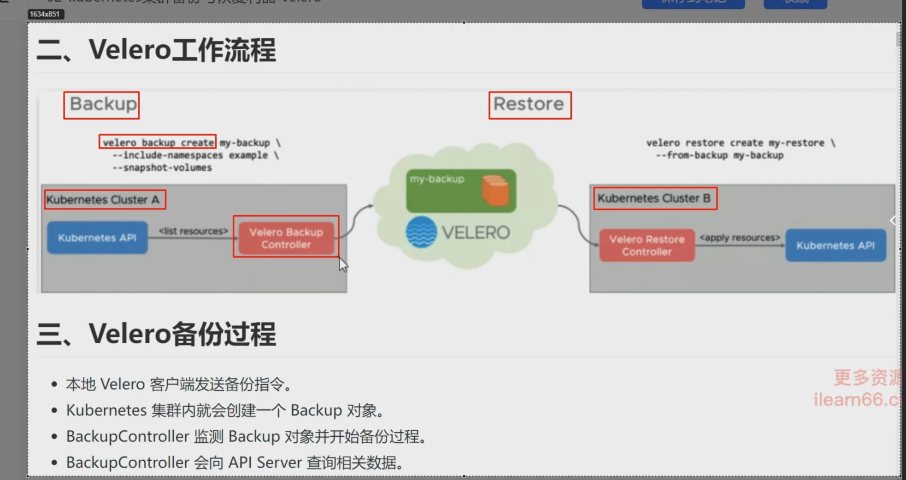
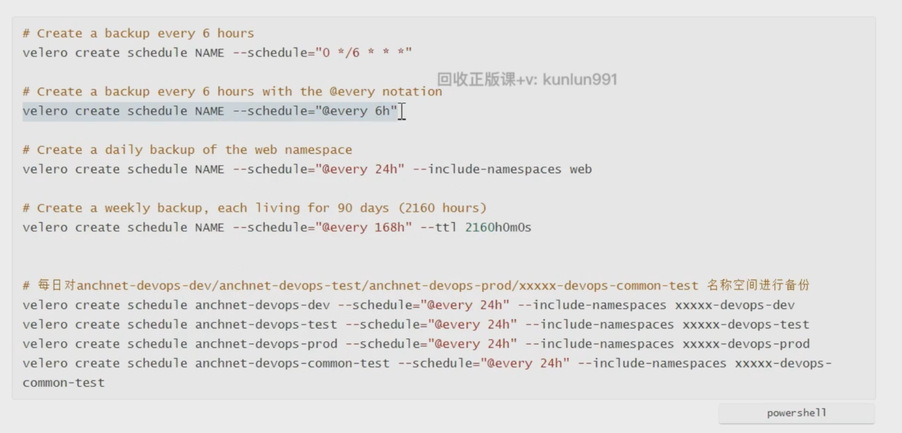

生产环境与测试环境不一致 

velero  可以快速的将生产环境复制到


工作流程 



```plain
备份流程：
用户命令 → 收集资源 → 创建快照或文件备份 → 上传对象存储 → 记录状态

恢复流程：
用户命令 → 下载备份 → 重建资源 → 恢复卷数据 → 验证状态
```


四，velero特性
velero 目前包含以下特性：
支持kubernetes 集群数据备份和恢复
支持复制当前kubernetes 集群的资源到其它kubernetes 集群
支持复制生产环境到开发以及测试环境


五，velero组件
velero组件一共分两部分，分别是服务端和客户端。
服务端：运行在你 kubernetes 的集群中
比客户端：是一些运行在本地的命令行的工具，需要已配置好kubectl及集群kubeconfig的机器上


六，velero支持备份存储

aws s3 以及兼容 s3 的存储， 比如：minio
azure  blob  存储
google  cloud  存储
阿里云oss


velero适用场景
灾备场景：提供备份恢复k8s集群的能力
15移场最：提供拷贝集群资源到其他集群的能力（复制同步开发，测试，生产环境的集群配置，简化环境配置）


velero备份与etcd备份的区别
与etcd备份相比，直接备份etcd是将集群的全部资源备份起来。
velero可以对 以对kubernetes 集群内对象级别进行备份。
,除了对kubemetes集群进行整体备份外，velero还可以通过对type.namespace.label等对象进行分类备份或者恢复（
注意：备份过程中创建的对象是不会被备份的）


#### velero安装

华为云CCE部署安装velero文档地址

https://support.huaweicloud.com/bestpractice-cce/cce_bestpractice_0310.html

velero安装命令如下，因为是备份到华为云OBS中，需要获取权限账户AK和SK

velero github下载地址，下载需要的版本即可

https://github.com/vmware-tanzu/velero/releases

velero install \--provider aws \--plugins velero/velero-plugin-for-aws:v1.2.1 \--bucket jdocloud-k8s-live-backup \--secret-file /home/renzhong/velero-v1.4.2-linux-amd64/examples/minio/credentials-velero \--use-restic \--use-volume-snapshots=false \--backup-location-config region=cn-north-4,s3ForcePathStyle="true",s3Url=[http://obs.cn-north-4.myhuaweicloud.com](http://obs.cn-north-4.myhuaweicloud.com/)

重要的参数及其说明如下

--provider：声明使用的 Velero 插件类型

--plugins：使用 S3 API 兼容插件 “velero-plugin-for-aws ”

--bucket：在腾讯云 COS 创建的存储桶名

--secret-file：访问 COS 的访问凭证文件，见上面创建的 “credentials-velero”凭证文件

--use-restic：使用开源免费备份工具 restic 备份和还原持久卷数据

--default-volumes-to-restic：使用 restic 来备份所有Pod卷，前提是需要开启 --use-restic 参数

--backup-location-config：备份存储桶访问相关配置

--region：兼容 S3 API 的 COS 存储桶地区，例如创建地区是广州的话，region 参数值为“ap-guangzhou”

--s3ForcePathStyle：使用 S3 文件路径格式

--s3Url：COS 兼容的 S3 API 访问地址

--use-volume-snapshots=false 来关闭存储卷数据快照备份。

secret-file文件内容

安装完成后，会在k8s集群velero名称空间下，运行一个pod

**
** 

下载适用于您操作系统的 **Velero CLI**：

```plain
bash

复制
# Linux/macOS 示例
wget https://github.com/vmware-tanzu/velero/releases/download/v1.11.0/velero-v1.11.0-linux-amd64.tar.gz
tar -xvf velero-v1.11.0-linux-amd64.tar.gz
sudo mv velero-v1.11.0-linux-amd64/velero /usr/local/bin/
```

velero 命令

```plain
velero  create backup --help  创建备份  可以对全部备份  对指定命名空间备份  对非全部命名空间备份 
```


```plain
创建备份
velero backup create nginx-backup  --inclue-namesepces  nginx-exapmle

查看备份 
velero backup describel nginx-backup 

查看备份位置
veloro  backup-location get

查看备份文件 
kubectl get backups.velro.io -n velero 
```


恢复 

```plain
velero restore  create --from-backup  nginx-backup --wait  记得要确定看看有没有 
```


周期性备份任务



注意事项：
在velero备份的时候，备份过程中创建的对象是不会被备份的。
restore之前提前删除现有的资源。
velero也可作为一个crontjob来运行，定期备份数据。

其他命令


从其他的k8s集群中部署velero 以及恢复应用 

先部署velro

```plain
先拷贝二进制的
然后部署  部署的时候 指定下对象存储 
```

然后恢复应用到k8s集群 

```plain
先查看是否有恢复的备份的

velero  backup-location get


velero backup get

velero restor create  --namecape velero  --from-backup  nginx-backup --wait
```


```plain
velero backup get -n velero


velero restore create --from-backup ${backupName} -n velero #恢复所有名称空间


velero restore create --from-backup ${backupName} --include-namespaces jdocloud -n velero #恢复指定名称空间


velero schedule get -n velero


velero delete schedule ${scheduleName} -n velero


velero create schedule all-ns-backup --schedule="0 1 * * *" --ttl 720h0m0s -n velero
```