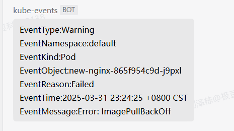
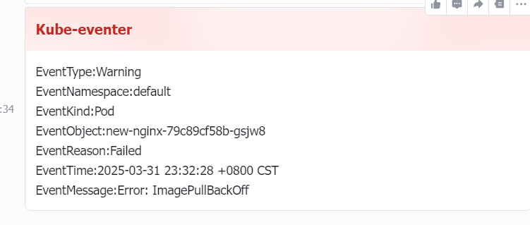

博哥博客地址 

https://blog.csdn.net/weixin_46887489/article/details/135684251?spm=1001.2014.3001.5502


下面是`kube-eventer`的github开源地址：

https://github.com/AliyunContainerService/kube-eventer


主要查看的是webhook里面 

https://github.com/AliyunContainerService/kube-eventer/blob/master/docs/en/webhook-sink.md

里面的信息


注意 如果时间有延迟6s 算正常的 

传输信息需要时间

但是时间大于30多s 要检查服务器的时间 是否是最新同步的时间 


下面是博哥的例子

```toml
---
apiVersion: v1
data:
  content: >- ##看他github文档里面 用什么 这里的body 名字就是什么  
    {"EventType": "{{ .Type }}","EventNamespace": "{{
    .InvolvedObject.Namespace }}","EventKind": "{{ .InvolvedObject.Kind }}","EventObject": "{{
    .InvolvedObject.Name }}","EventReason": "{{
    .Reason }}","EventTime": "{{ .LastTimestamp }}","EventMessage": "{{ .Message
    }}"}
kind: ConfigMap
metadata: 
  name: kubeeventer-webhook  ##这个的name要跟下面的对应 
  namespace: kube-system 


---
apiVersion: apps/v1
kind: Deployment
metadata:
  labels:
    name: kube-eventer
  name: kube-eventer-webhook
  namespace: kube-system
spec:
  replicas: 1
  selector:
    matchLabels:
      app: kube-eventer
  template:
    metadata:
      labels:
        app: kube-eventer
      annotations:	
        scheduler.alpha.kubernetes.io/critical-pod: ''
    spec:
      dnsPolicy: ClusterFirstWithHostNet
      serviceAccount: kube-eventer
      containers:
        - image: registry.aliyuncs.com/acs/kube-eventer:v1.2.7-ca03be0-aliyun  ##国内镜像源
#        - image: registry.us-west-1.aliyuncs.com/acs/kube-eventer:v1.2.7-ca03be0-aliyun #国外镜像源
          name: kube-eventer
          command:
            - "/kube-eventer"
            - "--source=kubernetes:https://test-cnk8s.boge.com:6443"  #要改为自己集群的apiserver地址 如果要查看这个的话 grep viperliu.com /etc/kubeasz/clusters/viperliu/config.yaml
            ## .e.g,dingtalk sink demo
            #- --sink=dingtalk:[your_webhook_url]&label=[your_cluster_id]&level=[Normal or Warning(default)]&namespaces=[kube-system,kae-app(all)]
            - --sink=webhook:http://alertmanaer-dingtalk-svc.kube-system/b01bdc063/boge/getjson?level=Warning&kinds=Pod&method=POST&header=Content-Type=application/json&custom_body_configmap=kubeeventer-webhook&custom_body_configmap_namespace=kube-system
            - --sink=webhook:webhook地址 ?level=Warning告警的级别&kinds=Pod监控的pod&method=POST请求&header=Content-Type=application/json&custom_body_configmap=kubeeventer-webhook指定的那个configmap&custom_body_configmap_namespace=kube-system以及configmap对应的名称空间
          env:
          # If TZ is assigned, set the TZ value as the time zone
          - name: TZ
            value: "Asia/Shanghai" 
          volumeMounts:
            - name: localtime
              mountPath: /etc/localtime
              readOnly: true
            - name: zoneinfo
              mountPath: /usr/share/zoneinfo
              readOnly: true
          resources:
            requests:
              cpu: 100m
              memory: 100Mi
            limits:
              cpu: 500m
              memory: 250Mi
      hostAliases:
      - hostnames:
        - test-cnk8s.boge.com  ##无公网解析的话
        ip: 10.0.1.201  ##要本地hosts解析 
      volumes:
        - name: localtime
          hostPath:
            path: /etc/localtime
        - name: zoneinfo
          hostPath:
            path: /usr/share/zoneinfo
---
apiVersion: rbac.authorization.k8s.io/v1
kind: ClusterRole
metadata:
  name: kube-eventer
rules:
  - apiGroups:
      - ""
    resources:
      - configmaps
      - events
    verbs:
      - get
      - list
      - watch
---
apiVersion: rbac.authorization.k8s.io/v1
kind: ClusterRoleBinding
metadata:
  name: kube-eventer
roleRef:
  apiGroup: rbac.authorization.k8s.io
  kind: ClusterRole
  name: kube-eventer
subjects:
  - kind: ServiceAccount
    name: kube-eventer
    namespace: kube-system
---
apiVersion: v1
kind: ServiceAccount
metadata:
  name: kube-eventer
  namespace: kube-system
```


自己跑通的企业微信的例子  


grep viperliu.com /etc/kubeasz/clusters/viperliu/config.yml 

  \- viperliuk8s.viperliu.com

这个域名 


vim event.yaml 

kubectl -n kube-system apply -f  eventer.yaml 

随便镜像一个换一个不存在的  

然后会报错镜像warning 


这里博哥是转发给自己的服务了 我们要搞一个自己的webhook 

相比官方的例子来说 多了个namespace空间  多了个资源的名字  

下面这个是企业微信的 

```toml
---
apiVersion: v1
data:
  content: >-
     {"msgtype": "text","text": {"content": "EventType:{{ .Type }}\nEventNamespace:{{ .InvolvedObject.Namespace }}\nEventKind:{{ .InvolvedObject.Kind }}\nEventObject:{{ .InvolvedObject.Name }}\nEventReason:{{ .Reason }}\nEventTime:{{ .LastTimestamp }}\nEventMessage:{{ .Message }}"}}
kind: ConfigMap
metadata: 
  name: kubeeventer-webhook
  namespace: kube-system 


---
apiVersion: apps/v1
kind: Deployment
metadata:
  labels:
    name: kube-eventer
  name: kube-eventer-webhook
  namespace: kube-system
spec:
  replicas: 1
  selector:
    matchLabels:
      app: kube-eventer
  template:
    metadata:
      labels:
        app: kube-eventer
    spec:
      priorityClassName: system-cluster-critical
      dnsPolicy: ClusterFirstWithHostNet
      serviceAccount: kube-eventer
      containers:
        - image: registry.aliyuncs.com/acs/kube-eventer:v1.2.7-ca03be0-aliyun
#        - image: registry.us-west-1.aliyuncs.com/acs/kube-eventer:v1.2.7-ca03be0-aliyun
          name: kube-eventer
          command:
            - "/kube-eventer"
            - "--source=kubernetes:https://viperliuk8s.viperliu.com:6443"
            ## .e.g,dingtalk sink demo
            #- --sink=dingtalk:[your_webhook_url]&label=[your_cluster_id]&level=[Normal or Warning(default)]&namespaces=[kube-system,kae-app(all)]
            - --sink=webhook:https://qyapi.weixin.qq.com/cgi-bin/webhook/send?key=0afd217b-26e5-409f-9583-5422e833676b&level=Warning&kinds=Pod&method=POST&header=Content-Type=application/json&custom_body_configmap=kubeeventer-webhook&custom_body_configmap_namespace=kube-system

          env:
          # If TZ is assigned, set the TZ value as the time zone
          - name: TZ
            value: "Asia/Shanghai" 
          volumeMounts:
            - name: localtime
              mountPath: /etc/localtime
              readOnly: true
            - name: zoneinfo
              mountPath: /usr/share/zoneinfo
              readOnly: true
          resources:
            requests:
              cpu: 100m
              memory: 100Mi
            limits:
              cpu: 500m
              memory: 250Mi
      hostAliases:
      - hostnames:
        - viperliuk8s.viperliu.com
        ip: 172.16.15.110
      volumes:
        - name: localtime
          hostPath:
            path: /etc/localtime
        - name: zoneinfo
          hostPath:
            path: /usr/share/zoneinfo
---
apiVersion: rbac.authorization.k8s.io/v1
kind: ClusterRole
metadata:
  name: kube-eventer
rules:
  - apiGroups:
      - ""
    resources:
      - configmaps
      - events
    verbs:
      - get
      - list
      - watch
---
apiVersion: rbac.authorization.k8s.io/v1
kind: ClusterRoleBinding
metadata:
  name: kube-eventer
roleRef:
  apiGroup: rbac.authorization.k8s.io
  kind: ClusterRole
  name: kube-eventer
subjects:
  - kind: ServiceAccount
    name: kube-eventer
    namespace: kube-system
---
apiVersion: v1
kind: ServiceAccount
metadata:
  name: kube-eventer
  namespace: kube-system
```

最后的效果




然后需要在搞一个  飞书的

```toml
---
apiVersion: v1
data:
   content: |
    {
      "msg_type": "interactive",
      "card": {
        "config": {
          "wide_screen_mode": true,
          "enable_forward": true
        },
        "header": {
          "title": {
            "tag": "plain_text",
            "content": "Kube-eventer"
          },
          "template": "Red"
        },
        "elements": [
          {
            "tag": "div",
            "text": {
              "tag": "lark_md",
              "content": "EventType:{{ .Type }}\nEventNamespace:{{ .InvolvedObject.Namespace }}\nEventKind:{{ .InvolvedObject.Kind }}\nEventObject:{{ .InvolvedObject.Name }}\nEventReason:{{ .Reason }}\nEventTime:{{ .LastTimestamp }}\nEventMessage:{{ .Message }}"
            }
          }
        ]
      }
    }

kind: ConfigMap
metadata: 
  name: kubeeventer-webhook
  namespace: kube-system 


---
apiVersion: apps/v1
kind: Deployment
metadata:
  labels:
    name: kube-eventer
  name: kube-eventer-webhook
  namespace: kube-system
spec:
  replicas: 1
  selector:
    matchLabels:
      app: kube-eventer
  template:
    metadata:
      labels:
        app: kube-eventer
    spec:
      priorityClassName: system-cluster-critical
      dnsPolicy: ClusterFirstWithHostNet
      serviceAccount: kube-eventer
      containers:
        - image: registry.aliyuncs.com/acs/kube-eventer:v1.2.7-ca03be0-aliyun
#        - image: registry.us-west-1.aliyuncs.com/acs/kube-eventer:v1.2.7-ca03be0-aliyun
          name: kube-eventer
          command:
            - "/kube-eventer"
            - "--source=kubernetes:https://viperliuk8s.viperliu.com:6443"
            ## .e.g,dingtalk sink demo
            #- --sink=dingtalk:[your_webhook_url]&label=[your_cluster_id]&level=[Normal or Warning(default)]&namespaces=[kube-system,kae-app(all)]
            - --sink=webhook:https://open.feishu.cn/open-apis/bot/v2/hook/bf7dc635-13a5-4c55-8b22-115a585353a7?level=Warning&method=POST&header=Content-Type=application/json&custom_body_configmap=kubeeventer-webhook&custom_body_configmap_namespace=kube-system

          env:
          # If TZ is assigned, set the TZ value as the time zone
          - name: TZ
            value: "Asia/Shanghai" 
          volumeMounts:
            - name: localtime
              mountPath: /etc/localtime
              readOnly: true
            - name: zoneinfo
              mountPath: /usr/share/zoneinfo
              readOnly: true
          resources:
            requests:
              cpu: 100m
              memory: 100Mi
            limits:
              cpu: 500m
              memory: 250Mi
      hostAliases:
      - hostnames:
        - viperliuk8s.viperliu.com
        ip: 172.16.15.110
      volumes:
        - name: localtime
          hostPath:
            path: /etc/localtime
        - name: zoneinfo
          hostPath:
            path: /usr/share/zoneinfo
---
apiVersion: rbac.authorization.k8s.io/v1
kind: ClusterRole
metadata:
  name: kube-eventer
rules:
  - apiGroups:
      - ""
    resources:
      - configmaps
      - events
    verbs:
      - get
      - list
      - watch
---
apiVersion: rbac.authorization.k8s.io/v1
kind: ClusterRoleBinding
metadata:
  name: kube-eventer
roleRef:
  apiGroup: rbac.authorization.k8s.io
  kind: ClusterRole
  name: kube-eventer
subjects:
  - kind: ServiceAccount
    name: kube-eventer
    namespace: kube-system
---
apiVersion: v1
kind: ServiceAccount
metadata:
  name: kube-eventer
  namespace: kube-system
```

飞书最后的效果

