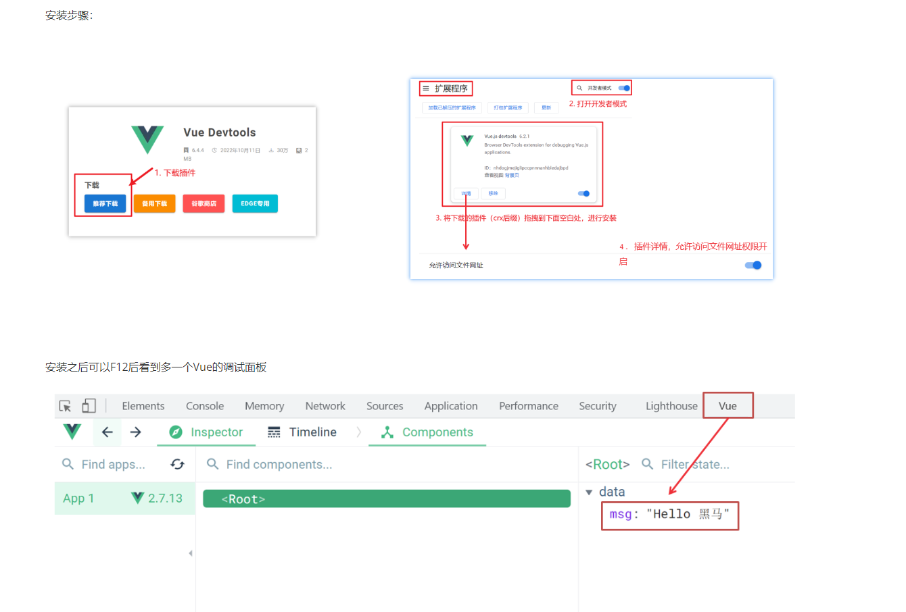
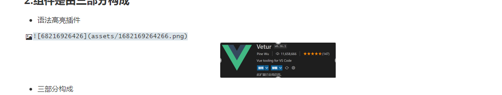
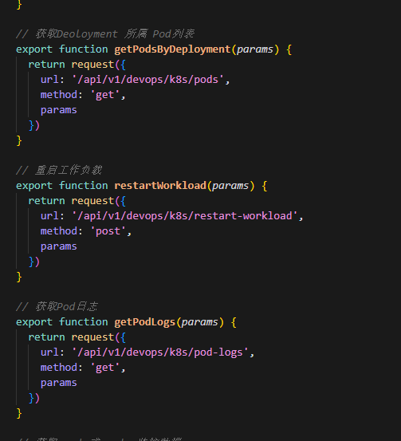

# npm

访问 https://nodejs.org/zh-cn/ 下载并安装 Node.js（选择 LTS 长期支持版本）


npm config set registry http://mirrors.cloud.tencent.com/npm/

npm config get registry


\# 全局安装 Vue CLI

npm install -g @vue/cli

\# 创建新项目

vue create k8s-dashboard


\# 在创建过程中会问你选择配置，选择 "Default (Vue 2)" 即可


下载依赖  npm instal


启动是npm run server

打包 是 npm run build


# vscode插件

vscoe里面 装live-server插件 随时进行run 页面的调试 


## Vue开发者工具安装


1. 通过谷歌应用商店安装（国外网站）
2. 极简插件下载（推荐） https://chrome.zzzmh.cn/index





语法高亮插件




https://element.eleme.cn/#/zh-CN


# 前后端联调


后端暴漏接口的地址 

然后前端在src下 api里面 使用方法请求 拿到数据 




nginx

```plain
server {
    listen       80;
    server_name  100.100.129.244;  # 你的服务器 IP

    # 添加详细的访问和错误日志
    access_log  /var/log/nginx/k8s-dashboard.access.log;
    error_log   /var/log/nginx/k8s-dashboard.error.log debug;

    # 确保这里的路径正确
    root   /usr/share/nginx/k8s-dashboard;
    index  index.html;

    location / {
        try_files $uri $uri/ /index.html;
    }

    # 添加错误页面配置
    error_page  403 /403.html;
    error_page  404 /404.html;
    error_page  500 502 503 504 /50x.html;
}
```
