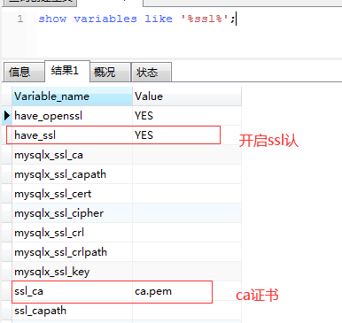
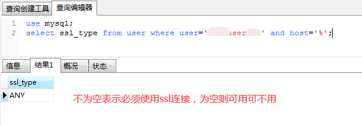
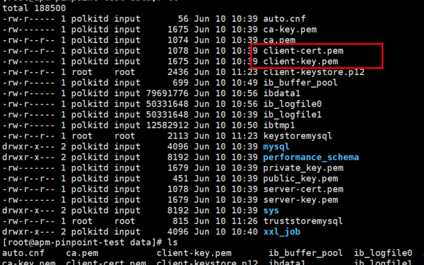
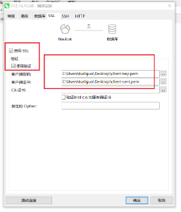
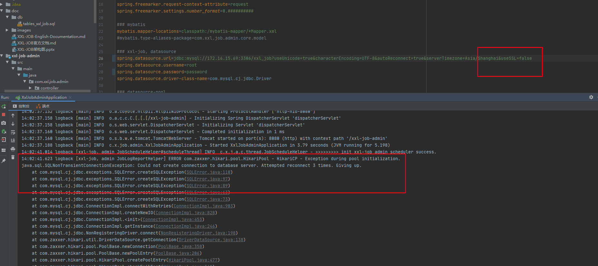

# mysql启用useSSL=true

# 测试环境搭建

mysql安装 ，    初始化： docker run -d -p 3306:3306 -v /usr/local/docker/mysql/[data:/var/lib/mysql](http://data/var/lib/mysql) -e MYSQL_ROOT_PASSWORD=password --name mysql5.7.18-3306 --restart=always 1347445564/mysql5.7.18last:latest

SpringBoot： 2.0.5.RELEASEmysql version：5.7.18

# 一、检查服务端是否开启ssl认证

show variables like '%ssl%';




# 二、确认用户强制使用ssl认证

## 1.检查用户是否启动ssl认证

```plain
use mysql;
select ssl_type from user where user='root' and host='%';
```

ps：root替换成具体的用户名。



## 2.强制用户使用ssl认证

```plain
ALTER USER 'root'@'%' REQUIRE SSL;
FLUSH PRIVILEGES;
```

## 三、生成客户端证书

## 1.找服务端提供三个原始文件


一般证书在mysql的安装目录下

[/var/lib/mysql](http://data/var/lib/mysql)



## 2.navicat 可以直接连接



## 3.datasource，spring boot连接

spring.datasource.url=jdbc:mysql://172.16.15.69:3306/xxl_job?useUnicode=true&characterEncoding=UTF-8&autoReconnect=true&serverTimezone=Asia/Shanghai&**useSSL=true**
spring.datasource.username=root
spring.datasource.password=password
spring.datasource.driver-class-name=com.mysql.cj.jdbc.Driver


ps: 如果在强制开启证书认证下，

datasource   **useSSL=false，则客户端服务无法连接数据库**

