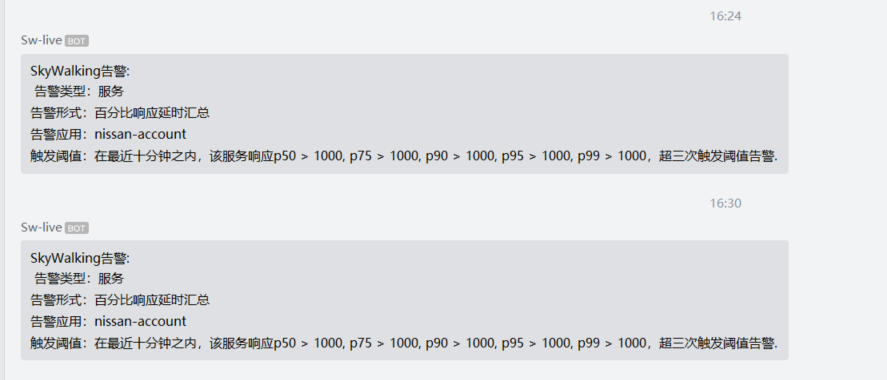

#  1. Skywalking-8.4.0

## 1.1. Skywalking简介

Apache SkyWalking**分布式**系统的**应用程序性能监视工具**，专为**微服务**、**云原生架构**和基于容器（Docker、**K8s**、Mesos）架构而设计，提供**分布式追踪**、**服务网格**遥测分析、度量聚合和可视化一体化解决方案。
关键词：**观察性分析平台**
**应用性能管理**
**云原生架构**
**全链路追踪**
**微服务**

## 1.2. 主要功能

1. **多种监控手段，语言探针和service mesh**
2. **多语言自动探针，Java，.NET Core，golang和Node.JS**
3. **轻量高效，不需要大数据**
4. **模块化，UI、存储、集群管理多种机制可选**
5. **支持告警**
6. **优秀的可视化方案**

## 1.3. 部署安装

**（一）常用安装方式** **官网下载：**[{+}](http://skywalking.apache.org/downloads/)http://skywalking.apache.org/downloads/+
**Github下载：**wget https://www.apache.org/dyn/closer.cgi/skywalking/8.4.0/apache-skywalking-apm-8.4.0.tar.gz
tar -xzf [apache-skywalking-apm-8.4.0.tar.gz](https://www.apache.org/dyn/closer.cgi/skywalking/6.4.0/apache-skywalking-apm-6.4.0.tar.gz)
解压包既可使用，包内分服务端和客户端
服务端使用：
\# /apache-skywalking-apm-incubating/bin ./startup.sh
客户端使用：
jvm参数配置：
java -javaagent:/usr/skywalking/agent/skywalking-agent.jar -Dskywalking.agent.service_name=jdocloud::refuelcp -jar xxxx.jar

## 1.4. 使用规范

1. 服务地址

1. 服务使用规范

**仪表板：**
可针对应用节点的服务，端点，实例进行细度监控图标展示
可针对数据库数据源的相关sql（慢sql)以及Cpm, service Apdex，service avg，Sla等常用参数进行监控展示

**拓扑图：**
各种图表应用实例全局展示

**链路追踪：**
监控细度在接口级别

**告警：**
可进行服务，服务实例，端点级别的监控，支持webhook告警模式，邮件钉钉自由开发。

## 1.5. 相关注意事项

###### 1.5.1.1.1.1. 1.修改数据库连接数据源

sw初期为提高性能降低资源使用，采用hbase文件数据库，造成重启oap后，旧数据丢失。
可根据需求自行修改使用mysql5.5+或es7.0.0版本。
**目前我们使用的数据库是 es7.6，数据保存时间7天。**

###### 1.5.1.1.1.2. 2.无用接口请求过滤

无用接口值相关的存活检测端口，在链路追踪会影响使用体验，可在客户端中进行配置进行过滤
skywalking-agent/config/apm-trace-ignore-plugin.config

###### 1.5.1.1.1.3. 3.traceid添加

traceid加入项目日志可进行日志查询时链路追踪，方便定位故障。对项目进行侵入添加：1.pom添加<dependency><groupId>org.apache.skywalking</groupId><artifactId>apm-toolkit-logback-1.x</artifactId><version>{project.release.version}</version></dependency>2.logback-spring.xml配置<appender name="STDOUT" class="ch.qos.logback.core.ConsoleAppender"><encoder class="ch.qos.logback.core.encoder.LayoutWrappingEncoder"><layout class="org.apache.skywalking.apm.toolkit.log.logback.v1.x.TraceIdPatternLogbackLayout"><Pattern>%d{yyyy-MM-dd HH:mm:ss.SSS} [%tid] [%thread] %-5level %logger{36} -%msg%n</Pattern></layout></encoder></appender>