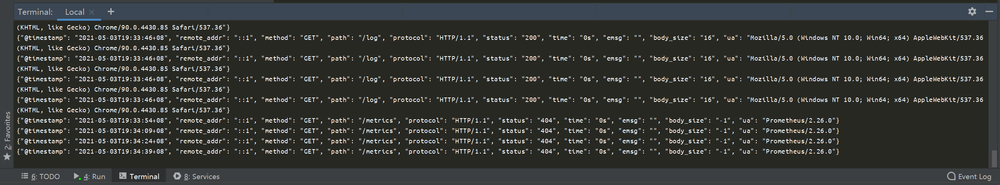

## 为何要将日志输出为JSON格式

我们的应用都运行在Kubernetes集群中，通常一个集群可能运行上千个服务，对于日志的处理我们采用了EFK Stack进行统一化收集和查看；以容器形式运行的服务，日志通常会打印到控制台，我们EFK中的Filebeat组件以DaemonSets方式运行(特权容器)，自动挂载Kubernetes集群宿主机的/var/log/container/*目录，搜寻内部所有的容器日志。

至于为何要将日志输出成JSON格式，有以下几个原因：

1. Elasticsearch对于JSON格式的日志，可以在Kibana中进行更好的展示和搜索、聚合，方便做基于应用日志的统计分析功能
2. Filebeat可以处理Docker Engine默认输出的日志，由于Docker默认输出就是JSON格式，Filebeat可以解析嵌套JSON格式，我们目前的Nginx日志就用该方法处理，效果很好


## 一个简单的示例

这个没有用第三方的包来实现，也比较简陋，可以自己定义不同的日志格式并定义日志级别，然后切换日志切换日志级别来控制日志量；只有这么几个要求：

1. 输出必须纯JSON格式
2. 单行输出
3. 必须具有timestamp字段，且值的格式必须ISO8601
4. 单行输出字数不能过高
5. JSON中间不能穿插其它格式，会影响解析效果


代码：

```plain
package main

import (
   "fmt"
   "github.com/gin-gonic/gin"
   "io"
   "net/http"
   "os"
)

func main()  {
   //日志输出配置，容器方式运行，日志统一打控制台
   gin.DefaultWriter = io.MultiWriter(os.Stdout)

   r := gin.New()

   //定义日志输出格式，字段不够可以再往里加
   r.Use(gin.LoggerWithFormatter(func(params gin.LogFormatterParams) string {
      return fmt.Sprintf("{\"timestamp\": \"%s\", \"remote_addr\": \"%s\", \"method\": \"%s\", \"path\": \"%s\", \"protocol\": \"%s\", \"status\": \"%d\", \"time\": \"%s\", \"emsg\": \"%s\", \"body_size\": \"%d\", \"ua\": \"%s\"}\n",
         //ISO8601  固定格式，不要更改，这个给Elasticsearch创建索引模式时使用
         params.TimeStamp.Format("2006-01-02T15:04:05+08"),
         params.ClientIP,
         params.Method,
         params.Path,
         params.Request.Proto,
         params.StatusCode,
         params.Latency,
         params.ErrorMessage,
         params.BodySize,
         params.Request.UserAgent(),
         //上面的字段可以根据需要做调整，以上字段是必备的几个
      )
   }))

   //测试日志输出
   r.GET("/log", func(c *gin.Context) {
      c.JSON(http.StatusOK, gin.H{
         "status": "200",
      })
   })

   r.Run(":8080")
}
```


## 效果

