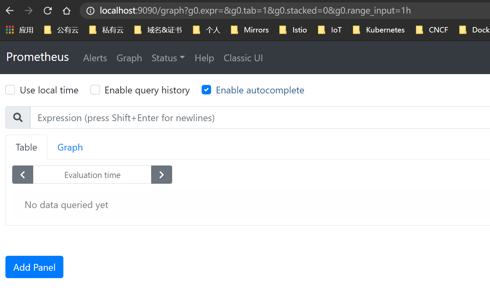
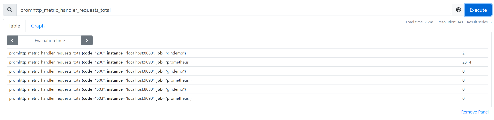
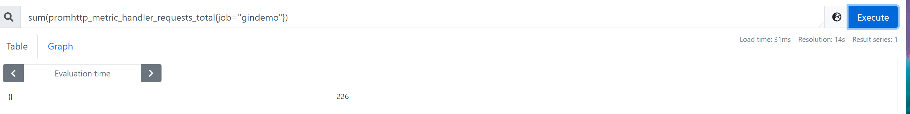
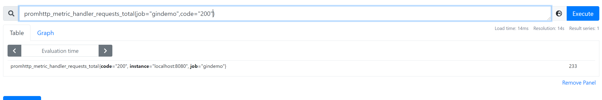
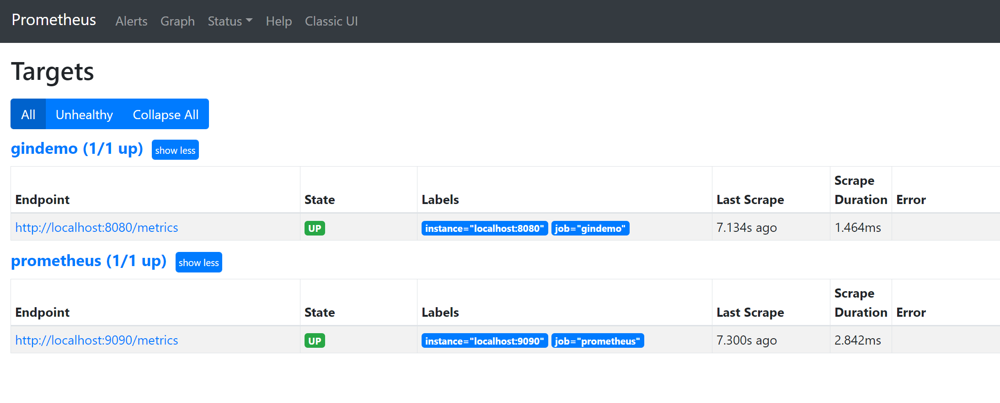
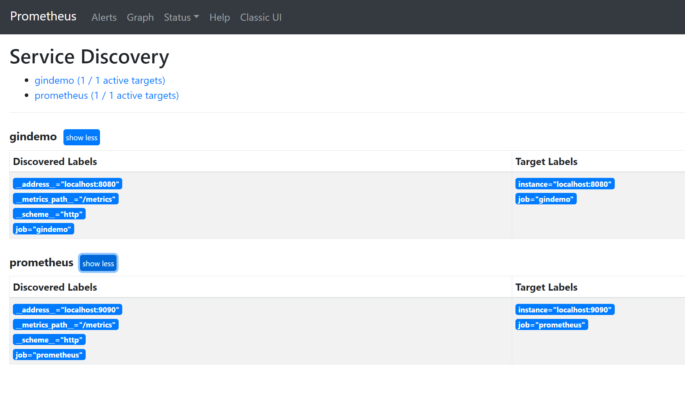

每个新起的go语言项目，最终都是要跑在我们的Kubernetes集群中，我们的集群通常都会提供一些必要的基础工具，用于统一化的收集应用的运行数据；进而提供监控或链路的数据展示，进而提高服务的可观测性。

本文主要针对在使用Go语言开发时，如何接入Prometheus，目前仅包含gin接入的示例，关于其它框架的接入，可以自行扩展

## 创建以下代码并运行它

```plain
package main

import (
   "github.com/Depado/ginprom"
   "github.com/gin-gonic/gin"
)

func main() {
   r := gin.New()

   //这里仅演示如何接入，关于业务指标的建立需要根据具体的业务来创建不同的指标，这些指标最终都会通过/metrics接口暴露
   prometheus_metrics := ginprom.New(
      ginprom.Engine(r),
      ginprom.Subsystem("gin"),
      //该path为prometheus默认抓取数据时使用的path，放到顶层路由后，监控数据不会被暴露到公网
      //prometheus会每隔一定的时间使用GET方法请求模块的这个接口，http://{}:8080/metrics
      ginprom.Path("/metrics"),
      )
   r.Use(prometheus_metrics.Instrument())

   r.Run(":8080")
}
```

## 下载Prometheus

我们将在本地起一个单独的Prometheus用以验证是否额可以采集到目标应用的指标，下面包含了不同系统平台的Prometheus下载地址

Windows: https://github.com/prometheus/prometheus/releases/download/v2.26.0/prometheus-2.26.0.windows-amd64.zip

Linux: https://github.com/prometheus/prometheus/releases/download/v2.26.0/prometheus-2.26.0.linux-amd64.tar.gz

OSX: https://github.com/prometheus/prometheus/releases/download/v2.26.0/prometheus-2.26.0.darwin-amd64.tar.gz

已上都是编译好的二进制包，解压后即可使用，下面是其中主要的文件和目录说明：

1. data目录：存放收集到的时序数据
2. prometheus.exe | prometheus：prometheus主程序
3. prometheus.yml：prometheus的主配置文件
4. promtool.exe | promtool：prometheus配置文件语法检测工具，主要验证配置文件的正确性

## 修改配置和验证配置

打开prometheus.yml文件，修改如下：

\# 全局配置
global:
  scrape_interval:     15s # 指标采集周期，每15秒收集一次最新数据
  evaluation_interval: 15s # 告警规则重新加载的时间，针对rule_files中定义的告警规则
  \# scrape_timeout is set to the global default (10s).


\# 告警管理服务配置
\# 这里可以对接Alermanager，用以验证告警的推送
alerting:
  alertmanagers:
  \- static_configs:
    \- targets:
      \# 如果你本地起了alermanager则直接打开下面的注释即可
      \# - alertmanager:9093

\# 告警规则文件定义，在这些文件中使用PromQL规则写表达式
rule_files:
  \# - "first_rules.yml"
  \# - "second_rules.yml"

\# 目标服务配置
scrape_configs:
  \# 该job为prometheus抓取自己的运行指标使用
  \- job_name: 'prometheus'
    \# metrics_path字段可以定义所要抓取目标服务监控数据的接口path，默认为/metrics
    \# metrics_path defaults to '/metrics'
    \# 使用的协议，http or https
    \# scheme defaults to 'http'.

​    static_configs:
​      \# 目标配置，ip地址 端口
​    \- targets: ['localhost:9090']
  
  \- job_name: 'gin-prometheus'
​    static_configs:
​    \- targets: ['localhost:8080']

保存已上配置文件，然后在prometheus所在目录启动cmd，使用promtools.exe check config prometheus.yml命令来检查配置文件的正确性，最后执行prometheus.exe启动该控制台进程

## 查询收集到的指标

我们可以在Pormtheus自带的UI上进行数据的查询，你也可以在本地另起Grafana工具，创建更好的视图用来展示收集到的运行指标和数据；使用浏览器打开[http://localhost:9090](http://localhost:9090/)



查询指标可以直接在搜索框中输入指标的名字，同时可以使用PromQL语法进行各种计算和筛选，下图我们统计下prometheus-server请求我们这个应用的/metrics接口时成功了多少次，我们使用ginprom包中默认定义的这个指标：promhttp_metric_handler_requests_total     (该指标是counter类型，服务重启后会清零)



仅筛选gindemo应用的总请求数(含200\500\503)，使用这个语句：sum(promhttp_metric_handler_requests_total{job="gindemo"})  求和



仅筛选gindemo应用的成功请求总数(状态码200）



服务状态和服务探测

状态： http://localhost:9090/targets



服务自动发现: http://localhost:9090/service-discovery



## 关于业务指标

上面的例子仅包含应引入ginprome后暴露出的一些默认的运行指标数据、和gin中的接口请求数据，如果需要加入业务指标请根据具体产品定义以及prometheus.io官方对于默认的一些指标类型的说明