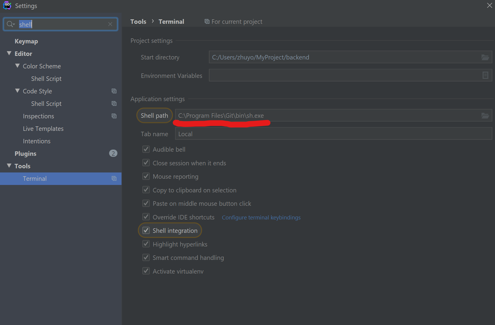
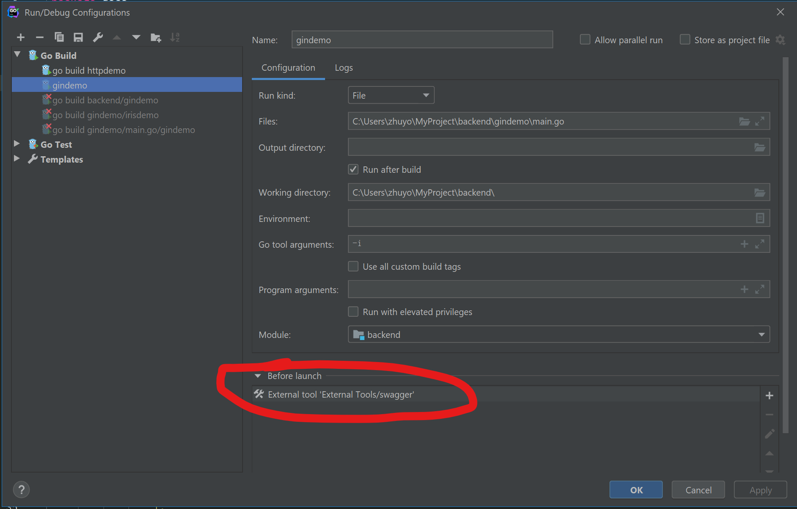
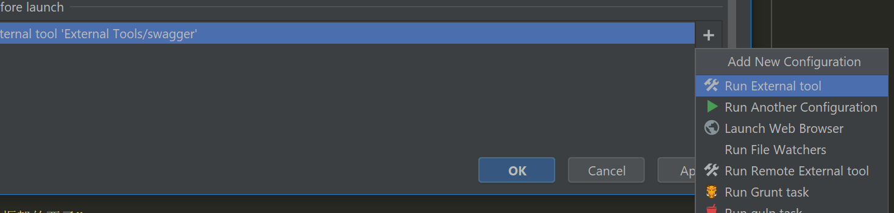
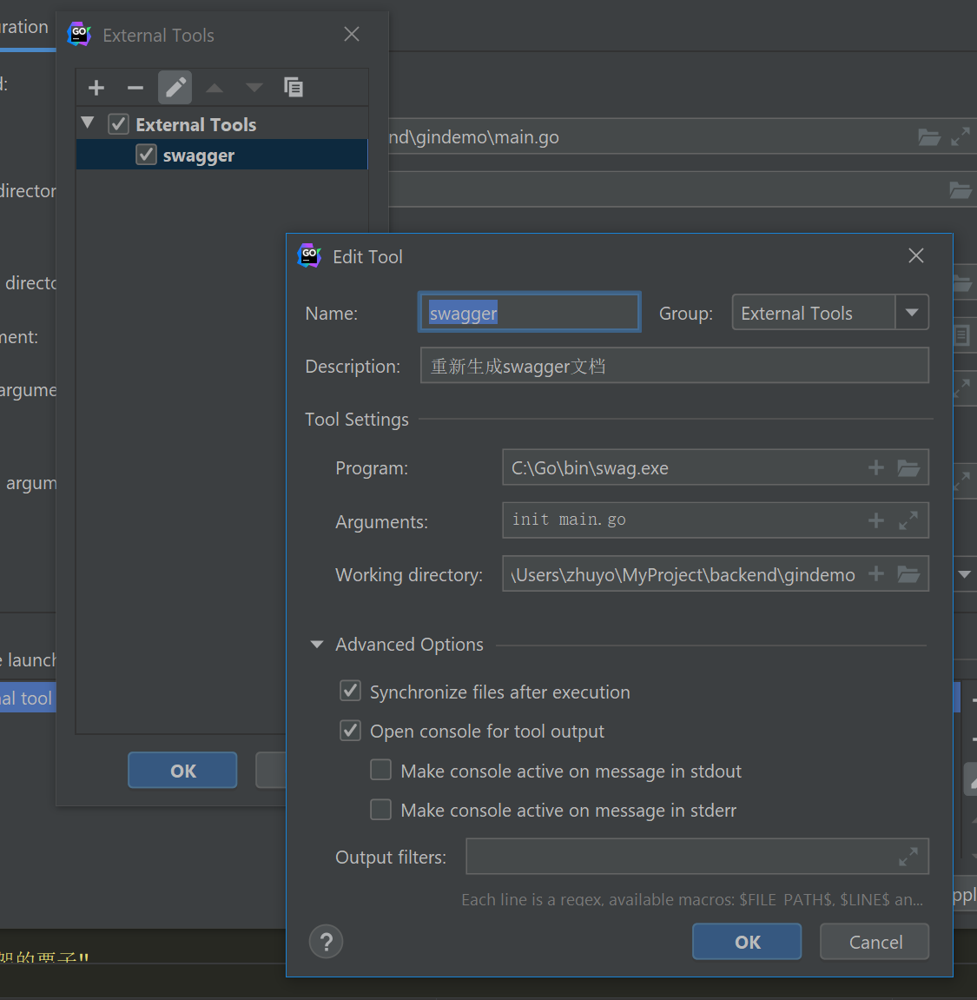
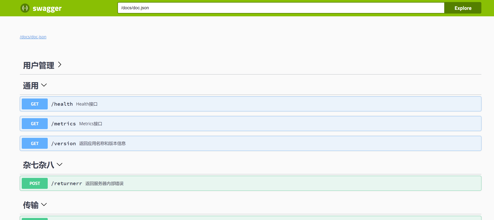
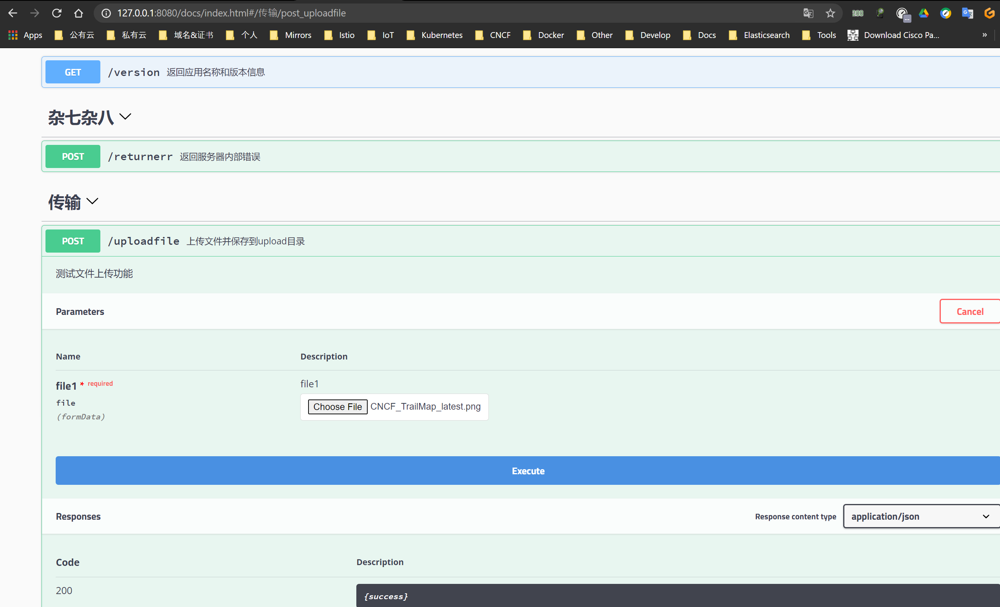

## 先决条件

1.我是在Goland中搞这个事情的，goland本身我做过一些调整，比如默认的bash我给替换为了git-bash，方便执行一些shell命令



2.打开一个新的Terminal，安装下swag命令行工具，这个用于生成初始的docs.go/swagger.json/swagger.yaml这几个文件

go get -u github.com/swaggo/swag/cmd/swag

3.在main.go所在目录下执行: swag init 会创建docs目录

4.每次重新编译代码时会扫描代码并自动生成最新docs目录的内容，需要在goland里增加构建前过程，每次build之前会重新生成一次，否则展示最新的文档内容不正常






## 一个没啥卵用的示例

```plain
package main

import (
   "fmt"
   // 这个位置得根据你自己代码具体情况改改
   _ "gindemo/main.go/gindemo/docs"
   "github.com/gin-gonic/gin"
   _ "github.com/swaggo/gin-swagger"
   ginSwagger "github.com/swaggo/gin-swagger"
   "github.com/swaggo/gin-swagger/swaggerFiles"
   "io"
   "net/http"
   "os"
)

type AppInfo struct {
   Application string
   Version string
}

var inf = AppInfo{
Application: "gin-demo",
Version: "v1.0.0",
}

// 这些奇特的注释用于swag命令行工具生成docs

// @Summary 这是个swagger使用的栗子
// @Title gin中使用swagger
// @Version 0.0.1
// @Description 这是个没什么卵用的函数
// @Tags 用户管理
// @BasePath /api/v1
// @Host 127.0.0.1:8080
// @Produce  json
// @Param appKey query string true "appKey"
// @Success 200 {string} json "{version}"
// @Router /api/v1/users/456 [get]
func Users(c *gin.Context) {
   if c.Query("appKey") == "123" && c.Param("userId") == "456" {
      c.JSON(http.StatusOK, "{\"status\": \"Success\"}")
   } else {
      c.JSON(http.StatusUnauthorized, "Auth ERR!")
   }
}

// @Summary 返回应用名称和版本信息
// @Title 版本
// @Version v1.0.0
// @Description 返回一些版本信息
// @Tags 通用
// @Host 127.0.0.1:8080
// @Produce json
// @Success 200 {string} json "{version}"
// @Router /version [get]
func Version(c *gin.Context) {
   c.JSON(http.StatusOK, inf)
}

// @Summary Post请求测试
// @Title Post方法用用
// @Version 0.0.1
// @Description 没啥其它作用
// @Tags 用户管理
// @Host 127.0.0.1:8080
// @Produce json
// @Param appKey query string true "appKey"
// @Success 200 {string} json "{UP}"
// @Router /post [post]
func PostTest(c *gin.Context) {
   c.JSON(http.StatusOK, "post")
}

// @Summary 上传文件并保存到upload目录
// @Title 传个文件上去
// @Version 0.0.1
// @Description 测试文件上传功能
// @Tags 传输
// @Host 127.0.0.1:8080
// @Accept multipart/form-data
// @Param file1 formData file true "file1"
// @Produce json
// @Success 200 {string} json "{success}"
// @Router /uploadfile [post]
func UploadFile(c *gin.Context) {
   f, err := c.FormFile("file1")
   if err != nil {
      c.JSON(http.StatusBadRequest, gin.H{
         "status": http.StatusBadRequest,
         "msg": err,
      })
      return
   } else {
      c.SaveUploadedFile(f, "gindemo/upload/"+f.Filename)
      c.JSON(http.StatusOK, gin.H{
         "status": http.StatusOK,
         "msg": "upload success",
      })
   }
}

// @Summary 返回服务器内部错误
// @Title gin返回500
// @Version 0.0.1
// @Description 测试乱七八糟的功能
// @Tags 杂七杂八
// @Host 127.0.0.1:8080
// @Accept application/json
// @Param appKey query string true "appKey"
// @Produce json
// @Success 200 {string} json "{success}"
// @Router /returnerr [post]
func ReturnErr(c *gin.Context) {
   c.JSON(http.StatusInternalServerError, gin.H{
      "status": http.StatusInternalServerError,
      "msg": "InternalServerError",
   })
   //promhttp_metric_handler_requests_total
}

func main() {
   //日志输出配置
   gin.DefaultWriter = io.MultiWriter(os.Stdout)
   //gin.DefaultWriter = colorable.NewColorableStdout()

   //切换工作模式, Debug or Release
   //gin.SetMode(gin.ReleaseMode)

   r := gin.New()

   //定义日志输出格式
   r.Use(gin.LoggerWithFormatter(func(params gin.LogFormatterParams) string {
      return fmt.Sprintf("{\"timestamp\": \"%s\", \"remote_addr\": \"%s\", \"method\": \"%s\", \"path\": \"%s\", \"protocol\": \"%s\", \"status\": \"%d\", \"time\": \"%s\", \"emsg\": \"%s\", \"body_size\": \"%d\", \"ua\": \"%s\"}\n",
         //ISO8601
         params.TimeStamp.Format("2006-01-02T15:04:05+08"),
         params.ClientIP,
         params.Method,
         params.Path,
         params.Request.Proto,
         params.StatusCode,
         params.Latency,
         params.ErrorMessage,
         params.BodySize,
         params.Request.UserAgent(),
      )
   }))

   //一个API组
   v1 := r.Group("/api/v1")

   //用户接口
   v1.GET("/users/:userId", Users)


   //加载文件上传的html
   //r.LoadHTMLGlob("gindemo/view/index.html")

   //返回HTML页面
   /*
   r.GET("/index.html", func(c *gin.Context) {
      c.HTML(http.StatusOK, "index.html", nil)
   })
    */

   //上传文件接口
   r.POST("/uploadfile", UploadFile)

   //返回服务器内部错误
   r.POST("/returnerr", ReturnErr)

   //POST请求测试
   r.POST("/post", PostTest)


   // Swagger-UI会请求该URL获取doc.json，用以渲染最终的页面
   url := ginSwagger.URL("/docs/doc.json")
   // 添加Swagger路由,使用通配符匹配
   r.GET("/docs/*any", ginSwagger.WrapHandler(swaggerFiles.Handler, url))

   r.Run(":8080")
}
```


## 效果



