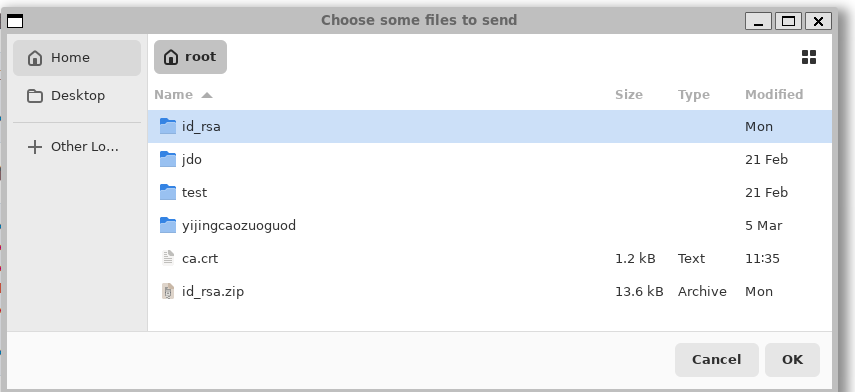
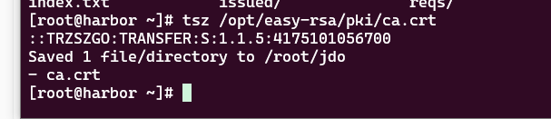

# trzsz

https://mp.weixin.qq.com/s/0GRdywZzVPLwlWtQU-WRgQ  参考文档


https://trzsz.github.io/


https://trzsz.github.io/cn/go


https://github.com/trzsz/tabby-trzsz


# 优势

速度比平常的传输速度快 可达到80mb/s

可以用来备份 传输等  也有多设备ssh管理功能 


# 背景

 不能使用xftp 等一些列工具的情况下  只能使用windows自带的终端 来传输文件  效率很慢 

我司都是用wsl 远程连接机器  需要在wsl上 下载 trzsz 


ubuntu操作系统 wsl机器上安装   这个是安装桌面操作系统的

```plain
sudo apt update
sudo apt install -y zenity
```


yum安装下载 trzsz-go 版本 

```plain
curl -fsSL "https://sh.wlnmp.com/wlnmp.sh" | bash

sudo yum install trzsz
```

ubuntu操作系统 下载

```plain
sudo apt update && sudo apt install software-properties-common
sudo add-apt-repository ppa:trzsz/ppa && sudo apt update

sudo apt install trzsz
```


需要wsl也安装trzsz  被连接的客户机器也要下载trzsz  

远程连接机器 

```plain
 trzsz ssh root@39.105.128.155  
```

到远程上去的机器 

输入trz 就出来图形化界面 可以找到 传输的文件




tsz  加要传输的文件



有进度条  然后到了wsl的机器上  


# 